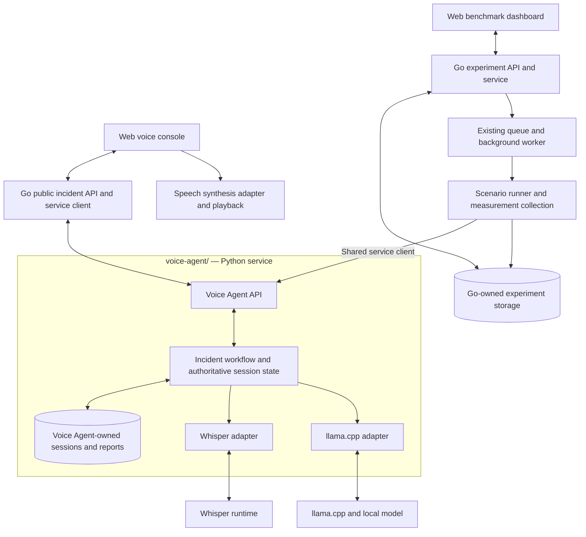
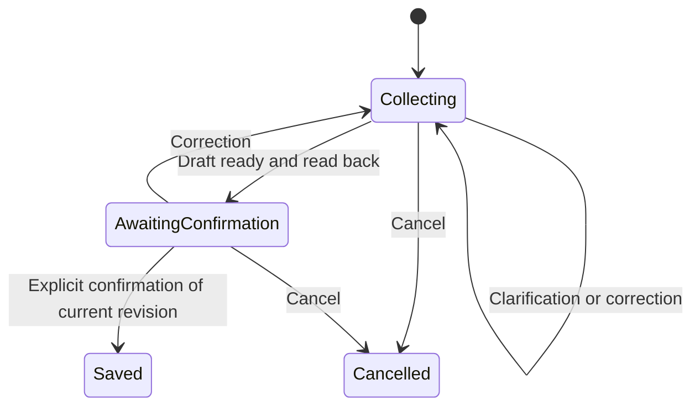

# System Architecture

This is the planned architecture for the [revised requirements](requirements.md). Only the components identified as current below are implemented.

## Current Foundation

* `api/`: Gin handlers, services, models, and the `IncidentAnalyzer` boundary. The transcript endpoint delegates to `MockIncidentAnalyzer`.
* `api/internal/benchmark/`: replaceable repository/runner boundaries, an in-memory queue/repository, a background worker, and a mock runner returning hardcoded values.
* `web/`: React/TypeScript/Vite, routing and reusable UI tooling, with a placeholder home page.
* Current endpoints: `GET /health`, `POST /api/v1/incidents/analyze`, `POST /api/v1/experiments`, and `GET /api/v1/experiments/:id`.
* Existing benchmark storage holds experiments, not incident reports. Python Voice Agent implements validation, health/readiness, and opt-in llama.cpp text analysis. There is no speech pipeline, conversation state, or persistent database.

## Development Architecture



The dedicated Voice Agent replaces the previously proposed generic AI service. It is the complete Use Case 1 backend, not another service layered beneath a separate incident workflow. Begin with Go, one Python HTTP service, and persistent inference runtimes. Adapter code lives inside `voice-agent/`; a runtime it calls may be a separate local process.

The benchmark runner invokes the same Voice Agent API through the shared Go client as interactive requests. Public endpoint/audio/client playback behaviour is also exercised in end-to-end scenarios. Keep benchmark sessions/reports isolated from interactive data.

## Ownership and Boundaries

| Component | Owns |
| --- | --- |
| Go handlers/services | Public HTTP contract, request validation, delegation through Voice Agent client |
| Go benchmark components | Experiment configuration, queue/worker, scenario execution, scoring and result storage |
| Voice Agent workflow | Authoritative sessions/drafts, intent, clarification, corrections, validated actions, confirmation, finalization, retrieval and response generation |
| Voice Agent runtime adapters | Whisper and llama.cpp configuration/calls, cancellation/timeouts, validated inference output |
| Voice Agent repositories | Incident/session persistence and atomic finalization |
| Go experiment repository | Benchmark configurations, status, measurements and scores |
| Web voice client | Audio capture/playback, speech output, interaction status, development inspection |
| Web dashboard | Experiment configuration, progress, results, comparison, export |

The Voice Agent loads its own session state and validates model proposals before executing bounded actions. Go forwards operations and does not maintain a duplicate incident state machine or access the Voice Agent database. Each service owns its repository implementations; separate SQLite files are sufficient without introducing database servers. Start with an explicit state machine and ordinary functions inside Voice Agent; LangGraph is optional future tooling.

Keep the existing `IncidentAnalyzer` interface and public text endpoint. Add `VoiceAgentIncidentAnalyzer` in Go, selected in `cmd/server/main.go`, and retain `MockIncidentAnalyzer` for tests. The [initial API contract](api/voice-agent.md) specifies the call and error mapping. Later session operations get dedicated client methods, rather than extending one-shot `Analyze` into a stateful operation.

## Planned Directory Layout

Create these files only during the corresponding implementation ticket:

```text
api/                            Public API, Voice Agent client, benchmarks
web/                            Voice console and benchmark dashboard
voice-agent/                    Dedicated Python service
  app/
    main.py                     HTTP service entry point
    incident_reporting/
      workflow.py               State transitions and validated actions
      models.py                 Analysis/session/domain contracts
      repository.py             Incident/session storage boundary
      prompts/                  Versioned extraction and response prompts
    adapters/
      whisper.py                Transcription runtime adapter
      llama_cpp.py              Language-model runtime adapter
  tests/                        Python contract/workflow/adapter tests
```

The Python import package is `app`; `voice-agent/` is a repository directory name, not a Python module identifier. Speech synthesis remains at the client/platform initially. `voice-agent/` now contains the application factory, configuration, stateless schemas/analysis service, a versioned prompt, llama.cpp adapter, and tests. Workflow and repositories in this planned layout remain unimplemented.

## Incident Workflow



The Voice Agent tracks draft revisions and owns all transitions above. A correction invalidates prior confirmation. Ambiguous responses must not finalize a report. Use request identifiers and atomic state updates so retries or concurrent requests cannot save duplicate reports or confirm a stale draft. Spoken confirmation and explicit confirmation controls must call the same service logic.

Start with text turns to test the workflow, then route transcribed audio through it. Add audio format normalization, bounded recording sizes/durations, silence handling, cancellation, and clear recoverable errors. Record stage timings from the first real inference integration.

## Proposed API and Data Contracts

The initial internal text-analysis API is defined in [Voice Agent API](api/voice-agent.md). The public endpoints below remain proposals, not currently available APIs. Session payloads and completeness policy will be finalized in T06 using the contract outline.

| Endpoint | Purpose |
| --- | --- |
| `POST /api/v1/sessions` | Start a conversation |
| `POST /api/v1/sessions/:id/turns` | Submit text or audio with a retry identifier |
| `POST /api/v1/sessions/:id/confirm` | Confirm a specific draft revision |
| `GET /api/v1/incidents` | Query reports using validated filters |
| `GET /api/v1/incidents/:id` | Read one report |
| `GET /api/v1/experiments` | Paginated/filterable experiment history |

Go delegates session/incident operations to the Voice Agent. Turn responses should expose transcript, reply text, state, and draft revision. Keep existing endpoint contracts unless an implementation ticket explicitly changes them.

Planned records include sessions (state/draft/revision), ordered turns (request IDs and transcripts), confirmed reports (IDs and occurrence/recording/confirmation timestamps), and execution traces (stage timings and configuration). The Voice Agent owns these incident/session records in SQLite. Go stores benchmark records separately; SQLite needs no database server. Define audio retention separately rather than retaining all recordings by default.

For report queries, the Voice Agent validates model-proposed parameters, executes parameterized SQL through its repository, then summarizes the returned records. Keep record IDs in the response/trace to verify grounding. Time-filtered retrieval does not require embeddings or a vector database.

## Runtime and Device Strategy

* Whisper is the speech-recognition baseline; whisper.cpp is the provisional implementation. Pin the evaluated model/runtime build.
* llama.cpp runs the selected local language model through a persistent local server during development. Keep model selection and quantization configurable.
* Speech synthesis is replaceable, initially at the client. Verify actual execution location/offline behaviour before including it in local-inference or energy claims.
* MERaLiON and fine-tuning are evaluation options if baseline local-speech errors justify them.

Jetson can start from the service-based prototype, subject to board/software validation. Fully local iOS deployment likely requires native runtime integration and adaptation of application logic rather than shipping Go/Python unchanged. Preserve schemas, prompts, state-transition specifications, and shared conformance scenarios for that port. Device selection remains pending; do not scaffold a native app yet.

Upstream implementation references: [llama.cpp](https://github.com/ggml-org/llama.cpp), [local server](https://github.com/ggml-org/llama.cpp/tree/master/tools/server), [whisper.cpp](https://github.com/ggml-org/whisper.cpp), and [Apple speech synthesis](https://developer.apple.com/documentation/avfaudio/avspeechsynthesizer). Validate compatibility against pinned versions during implementation.

## Benchmark Dashboard and Storage

Retain the existing asynchronous experiment lifecycle and in-memory queue. Add a real runner, Go-owned SQLite experiment/result repository, and history/filter APIs. Define interrupted-run status on restart; persistence alone does not make the in-memory queue durable.

The dashboard will create experiments, poll progress, display quality/performance/device metrics, compare configurations, and export results with metadata. Display unavailable measurements explicitly and highlight differing datasets or methods when comparing runs. The operational focus on speech does not remove this visual research interface.

Add directories only when used: `voice-agent/` for the incident solution and its persistence, Go experiment persistence beside the existing benchmark repository boundary, `tests/` for cross-service scenarios, and `scripts/` for setup. Keep Go unit tests beside source. No distributed queue, additional database service, or top-level benchmark service is required by this plan.
