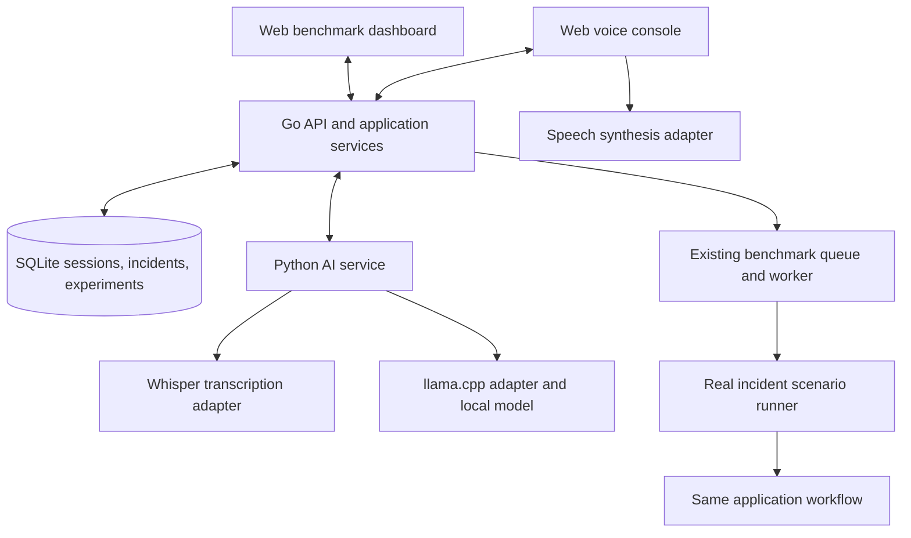
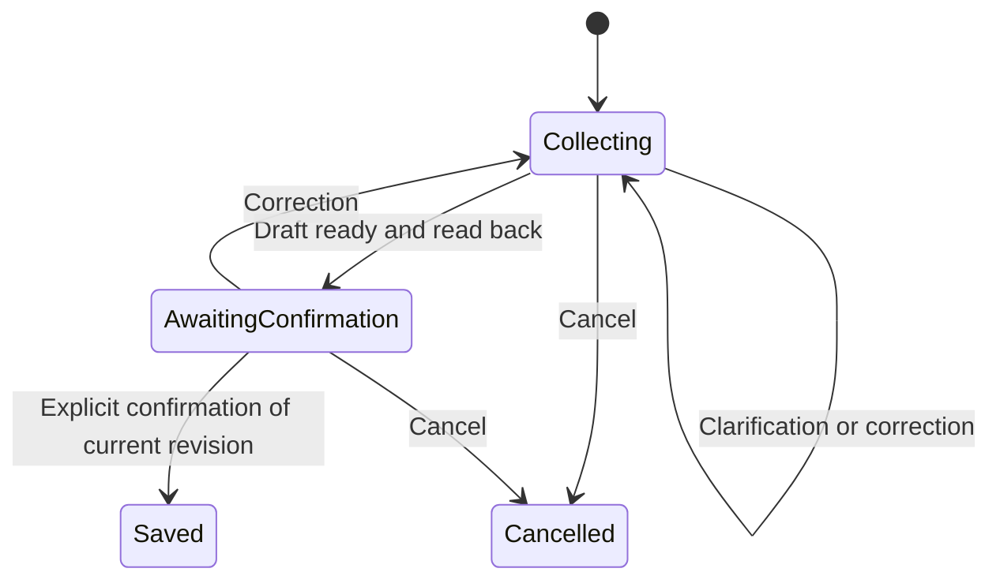

# System Architecture

This is the planned architecture for the [revised requirements](requirements.md). Only the components identified as current below are implemented.

## Current Foundation

* `api/`: Gin handlers, services, models, and the `IncidentAnalyzer` boundary. The transcript endpoint delegates to `MockIncidentAnalyzer`.
* `api/internal/benchmark/`: replaceable repository/runner boundaries, an in-memory queue/repository, a background worker, and a mock runner returning hardcoded values.
* `web/`: React/TypeScript/Vite, routing and reusable UI tooling, with a placeholder home page.
* Current endpoints: `GET /health`, `POST /api/v1/incidents/analyze`, `POST /api/v1/experiments`, and `GET /api/v1/experiments/:id`.
* Existing benchmark storage holds experiments, not incident reports. There is no Python service, speech pipeline, conversation state, or persistent database.

## Development Architecture

These are responsibilities, not separate microservices. Begin with Go, one Python HTTP service, and persistent inference runtimes. The benchmark runner should invoke the same application services used by interactive requests; endpoint/audio integration is also exercised in end-to-end scenarios.

## Ownership and Boundaries

| Component | Owns |
| --- | --- |
| Go handlers | HTTP parsing, status codes, request limits, response serialization |
| Go services | Authoritative session state, validated actions, confirmation, report finalization, retrieval |
| Python service | Transcription, intent interpretation, extraction, clarification proposals, grounded response generation |
| Runtime adapters | Runtime-specific configuration, requests, cancellation/timeouts, inference output |
| Repositories | Session/report persistence and atomic finalization; later experiment persistence |
| Client | Audio capture/playback, speech output, interaction status, development inspection |
| Dashboard | Experiment configuration, progress, results, comparison, export |

Python receives relevant session context from Go and returns validated proposals; it does not maintain a second authoritative conversation history. Go validates proposed fields and bounded actions before applying them. Start with an explicit state machine and ordinary functions; LangGraph is optional future tooling.

Keep the one-shot `IncidentAnalyzer` interface and existing public endpoint. Add `PythonIncidentAnalyzer`, selected through configuration in `cmd/server/main.go`, and retain the mock for tests. Add conversation services separately.

## Incident Workflow

Track draft revisions. A correction invalidates prior confirmation. Ambiguous responses must not finalize a report. Use request identifiers and atomic state updates so retries or concurrent requests cannot save duplicate reports or confirm a stale draft. Spoken confirmation and explicit confirmation controls must call the same service logic.

Start with text turns to test the workflow, then route transcribed audio through it. Add audio format normalization, bounded recording sizes/durations, silence handling, cancellation, and clear recoverable errors. Record stage timings from the first real inference integration.

## Proposed API and Data Contracts

These endpoints are proposals, not currently available APIs. Finalize schemas in roadmap ticket T02.

| Endpoint | Purpose |
| --- | --- |
| `POST /api/v1/sessions` | Start a conversation |
| `POST /api/v1/sessions/:id/turns` | Submit text or audio with a retry identifier |
| `POST /api/v1/sessions/:id/confirm` | Confirm a specific draft revision |
| `GET /api/v1/incidents` | Query reports using validated filters |
| `GET /api/v1/incidents/:id` | Read one report |
| `GET /api/v1/experiments` | Paginated/filterable experiment history |

Turn responses should expose transcript, reply text, state, and draft revision. Keep existing endpoint contracts unless an implementation ticket explicitly changes them.

Planned records include sessions (state/draft/revision), ordered turns (request IDs and transcripts), confirmed reports (IDs and occurrence/recording/confirmation timestamps), and execution traces (stage timings and configuration). SQLite solves local persistence without a database server. Define audio retention separately rather than retaining all recordings by default.

For report queries, validate model-proposed parameters, execute parameterized SQL, then summarize the returned records. Keep record IDs in the response/trace to verify grounding. Time-filtered retrieval does not require embeddings or a vector database.

## Runtime and Device Strategy

* Whisper is the speech-recognition baseline; whisper.cpp is the provisional implementation. Pin the evaluated model/runtime build.
* llama.cpp runs the selected local language model through a persistent local server during development. Keep model selection and quantization configurable.
* Speech synthesis is replaceable, initially at the client. Verify actual execution location/offline behaviour before including it in local-inference or energy claims.
* MERaLiON and fine-tuning are evaluation options if baseline local-speech errors justify them.

Jetson can start from the service-based prototype, subject to board/software validation. Fully local iOS deployment likely requires native runtime integration and adaptation of application logic rather than shipping Go/Python unchanged. Preserve schemas, prompts, state-transition specifications, and shared conformance scenarios for that port. Device selection remains pending; do not scaffold a native app yet.

Upstream implementation references: [llama.cpp](https://github.com/ggml-org/llama.cpp), [local server](https://github.com/ggml-org/llama.cpp/tree/master/tools/server), [whisper.cpp](https://github.com/ggml-org/whisper.cpp), and [Apple speech synthesis](https://developer.apple.com/documentation/avfaudio/avspeechsynthesizer). Validate compatibility against pinned versions during implementation.

## Benchmark Dashboard and Storage

Retain the existing asynchronous experiment lifecycle and in-memory queue. Add a real runner, SQLite experiment/result repository, and history/filter APIs. Define interrupted-run status on restart; persistence alone does not make the in-memory queue durable.

The dashboard will create experiments, poll progress, display quality/performance/device metrics, compare configurations, and export results with metadata. Display unavailable measurements explicitly and highlight differing datasets or methods when comparing runs. The operational focus on speech does not remove this visual research interface.

Add directories only when used: `ai-service/` for Python, `api/internal/repository/` for persistence, `tests/` for cross-service scenarios, and `scripts/` for setup. Keep Go unit tests beside source. No distributed queue, additional database service, or top-level benchmark service is required by this plan.
