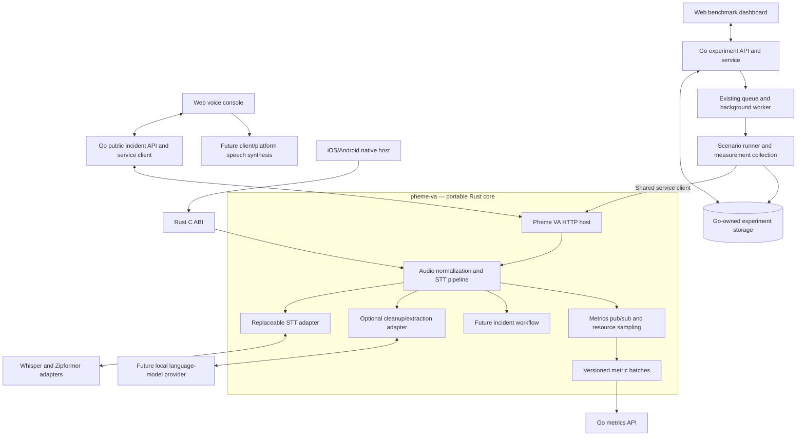
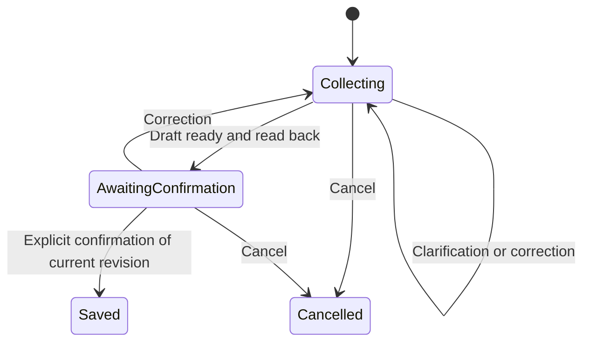

# System Architecture

This document separates the implemented foundation from the target architecture. The target workflow is intentionally described alongside the current state so that planned capabilities are not mistaken for shipped behavior.

## Implemented foundation

- `api/`: Go Gin handlers, services, models, the `IncidentAnalyzer` boundary, asynchronous benchmark lifecycle, and separate in-memory metrics ingestion. The public incident endpoint is still wired to `MockIncidentAnalyzer`; the benchmark worker still uses `MockRunner`.
- `pheme-va/`: the canonical Rust implementation. `core` owns WAV/PCM validation and normalization, mono 16 kHz conversion, speech gating, transcript guards, cleanup boundaries, model-neutral transcription, and the conservative rule-based incident extractor. `metrics` owns typed events, resource sampling, batching, and energy integration. `whispercpp` and optional `zipformer` are separate model adapters.
- `pheme-va/crates/cli/`: manifest-driven model selection, the one-shot WAV `transcribe` command, and a Ratatui TUI with onboarding, WAV browsing, microphone capture, worker-owned model switching, telemetry, structured logs, automatic allowlisted model downloads, adapter preparation, and bounded persistent run history.
- `pheme-va/crates/server/`: an Axum development HTTP host around the Rust core. It exposes stateless transcription, deterministic text incident analysis, health/readiness, and an in-memory metrics-batch drain. The server currently loads a direct Whisper model path; the CLI is the host that supports manifest-selected Whisper and Zipformer adapters.
- `pheme-va/crates/ffi/`: a direct-path Whisper C ABI for a future native mobile host, including optional metrics-batch draining. Native audio capture and mobile lifecycle remain host responsibilities.
- `web/`: React/TypeScript/Vite and Tailwind/shadcn tooling with a placeholder home page. The voice console and benchmark dashboard are not implemented.

### Current HTTP routes

The Go API and Rust development host are separate processes with separate route namespaces.

| Host | Method | Route                             | Current purpose                               |
| ---- | ------ | --------------------------------- | --------------------------------------------- |
| Go   | `GET`  | `/health`                         | Liveness                                      |
| Go   | `POST` | `/api/v1/incidents/analyze`       | Mock incident analysis                        |
| Go   | `POST` | `/api/v1/experiments`             | Queue a mock benchmark experiment             |
| Go   | `GET`  | `/api/v1/experiments/:id`         | Read an in-memory experiment                  |
| Go   | `POST` | `/api/v1/experiments/:id/metrics` | Append a validated metric batch               |
| Go   | `GET`  | `/api/v1/experiments/:id/metrics` | Read stored metric batches                    |
| Rust | `GET`  | `/health`                         | Liveness                                      |
| Rust | `GET`  | `/ready`                          | In-process Whisper readiness                  |
| Rust | `POST` | `/v1/transcribe`                  | Transcribe one complete WAV request           |
| Rust | `POST` | `/v1/analyze`                     | Deterministic transcript-to-report extraction |
| Rust | `GET`  | `/v1/metrics/batches`             | Drain buffered Rust metric batches            |

There are no session, confirmation, incident-persistence, incident-retrieval, speech-synthesis, or Go-to-Pheme forwarding routes yet. See [the Pheme VA API contract](api/voice-agent.md) for the current stateless Rust host contract and the proposed stateful workflow outline.

## Target development architecture

The following diagram is the intended integration once Go has a Pheme client and the real benchmark runner. It is not a claim that those connections are currently wired.



Pheme VA replaces the previously proposed generic AI service and the removed Python runtime. Its portable core has no UI, microphone permission, or mobile lifecycle ownership. Desktop/web hosts can use the Rust HTTP wrapper or CLI; native mobile hosts can embed the Rust library through the C ABI. The core and model crates keep transcription behind traits so validated local runtimes can be compared independently.

At present, the Go API does not call the Rust host: it uses `MockIncidentAnalyzer`, and its benchmark worker uses `MockRunner`. When implemented, the benchmark runner should exercise the same Pheme VA API as interactive requests while keeping benchmark sessions and reports isolated from operational data.

## Ownership and boundaries

These are target ownership boundaries for the complete system:

| Component                 | Owns                                                                                                                                         |
| ------------------------- | -------------------------------------------------------------------------------------------------------------------------------------------- |
| Go handlers/services      | Public HTTP contract, request validation, and delegation through a Pheme client                                                              |
| Go benchmark components   | Experiment configuration, queue/worker, scenario execution, scoring, and result storage                                                      |
| Go metrics repository     | Versioned metric-batch ingestion and separate metric storage                                                                                 |
| Pheme VA workflow         | Authoritative sessions/drafts, clarification, corrections, validated actions, confirmation, finalization, retrieval, and response generation |
| Pheme VA runtime adapters | Replaceable STT/LLM configuration and calls, cancellation/timeouts, and validated inference output                                           |
| Pheme VA repositories     | Incident/session persistence and atomic finalization                                                                                         |
| Rust metrics crate        | Typed events, internal subscriptions, resource-provider boundary, energy accumulation, and batch formation                                   |
| Web voice client          | Audio capture/playback, speech output, interaction status, and development inspection                                                        |
| Web dashboard             | Experiment configuration, progress, results, comparison, and export                                                                          |

Only the Rust core, model adapters, current stateless server operations, metrics path, CLI/TUI, and Go in-memory APIs in the foundation list are implemented. Go does not currently maintain a second Pheme workflow state machine or access a Pheme database; neither service has the planned persistent incident database yet.

Keep the existing Go `IncidentAnalyzer` interface and public text endpoint. A future Pheme-backed analyzer/client should be wired in `api/cmd/server/main.go` while retaining `MockIncidentAnalyzer` for tests. Stateful session operations should use dedicated client methods rather than turning the one-shot `Analyze` contract into a stateful operation.

## Current and planned directory layout

The following paths are already present:

```text
api/                            Go public API and benchmark lifecycle
web/                            React web scaffold
pheme-va/
  crates/core/                  Portable audio, workflow primitives, and adapter traits
  crates/metrics/               Typed timing/resource metric contract
  crates/cli/                   WAV client, microphone host, and TUI
  crates/server/                Development HTTP host
  crates/ffi/                   Native embedding boundary
  crates/models/whispercpp/     whisper.cpp model adapter
  crates/models/zipformer/      Optional LiteRT Zipformer adapter
  models/manifest.toml          Manifest model catalog
  models/README.md              Artifact sources/checksums/status
  scripts/                      Model download scripts
```

Future session/workflow modules and Pheme-owned SQLite repositories should be added only when their implementation milestones begin. Speech synthesis remains at the client/platform initially; no Python runtime, database server, distributed queue, or extra service is required for the current prototype.

## Incident workflow target

The complete voice workflow is planned as an explicit state machine owned by Pheme VA:



A correction must invalidate prior confirmation. Ambiguous responses must not finalize a report. Request identifiers, revision checks, and atomic state updates are required so retries or concurrent requests cannot save duplicate reports or confirm a stale draft. Spoken confirmation and any explicit confirmation control must call the same workflow logic.

The current Rust server does not implement this state machine. It provides stateless transcription and deterministic text extraction only. Start the future workflow with text turns, then route normalized audio through the same transitions. The existing Rust metrics path already records core stage timings, model metadata, workflow outcome, retry count, transcript status, resource snapshots, and explicit unavailable values for the operations it currently wraps; stateful workflow stages will extend that contract rather than create a second metrics system.

## Proposed API and data contracts

The following routes are proposals, not currently available APIs:

| Endpoint                            | Purpose                                         |
| ----------------------------------- | ----------------------------------------------- |
| `POST /api/v1/sessions`             | Start a conversation                            |
| `POST /api/v1/sessions/:id/turns`   | Submit text or audio with a retry identifier    |
| `POST /api/v1/sessions/:id/confirm` | Confirm a specific draft revision               |
| `GET /api/v1/incidents`             | Query finalized reports using validated filters |
| `GET /api/v1/incidents/:id`         | Read one report                                 |
| `GET /api/v1/experiments`           | Paginated/filterable experiment history         |

Go should delegate session and incident operations to Pheme VA rather than duplicating transitions. Turn responses should eventually expose the transcript, reply text, state, and draft revision. Pheme VA should own incident/session records; Go should store benchmark records separately.

Planned records include sessions, ordered turns, draft revisions, confirmed reports, and execution traces. Define audio retention separately; do not retain all recordings by default. Report queries should use validated filters and parameterized repository queries, summarize only returned records, and retain record IDs for grounding checks. Time-filtered retrieval does not require embeddings or a vector database.

## Runtime and device strategy

- Whisper/whisper.cpp is the current speech-recognition baseline. The optional `whispercpp` crate loads a model once and the CLI records the manifest model ID and revision in results/metrics.
- The optional `zipformer` crate implements the LiteRT Zipformer CTC adapter for the three manifest variants. Its quality, runtime, and target-device performance still require evaluation. The development Rust server currently remains direct-Whisper based.
- SeaLLMs-Audio is a download-only experiment. It is not a Whisper-compatible checkpoint and has no active Pheme VA adapter.
- A concrete llama.cpp-compatible language-model adapter is not implemented. `LanguageModel`/cleanup traits are replaceable seams; do not claim llama.cpp inference or a persistent local LLM server is part of the current runtime.
- Speech synthesis is planned and initially belongs to the web/native client. Verify its execution location before including it in local-inference or energy claims.
- MERaLiON and fine-tuning remain evaluation options if measured local-speech errors justify them.

A mobile phone remains the preferred eventual platform, with iOS or NVIDIA Jetson still pending confirmation. The current Linux build, CLI HTTP server, or a remote call is not evidence of on-device iOS inference. Native audio integration, Apple linking/Metal validation, signing, and physical-device tests remain future work.

Upstream references for future evaluation include [whisper.cpp](https://github.com/ggml-org/whisper.cpp), [LiteRT](https://ai.google.dev/edge/litert), and [Apple speech synthesis](https://developer.apple.com/documentation/avfaudio/avspeechsynthesizer). Pin and record versions during implementation.

## Benchmark dashboard and storage

Retain the current asynchronous Go experiment lifecycle and in-memory queue while it remains sufficient. The current runner is mocked and its result values are hardcoded; the separate metrics repository is also process-local. Planned work adds a real incident runner, measured resource integration, Go-owned persistent experiment/result storage, history/filter APIs, and dashboard comparison/export.

The dashboard will create experiments, poll progress, display quality/performance/device metrics, compare compatible configurations, and export reproducibility metadata. It must display unavailable measurements explicitly and flag differing datasets or measurement scopes instead of ranking incomparable runs silently. The operational focus on speech does not remove this visual research interface.

No distributed queue, additional database service, or top-level benchmark service is required by this plan. Keep Go unit tests beside their packages, Rust tests beside the relevant crate, and cross-service scenarios in a future top-level test location only when needed.
