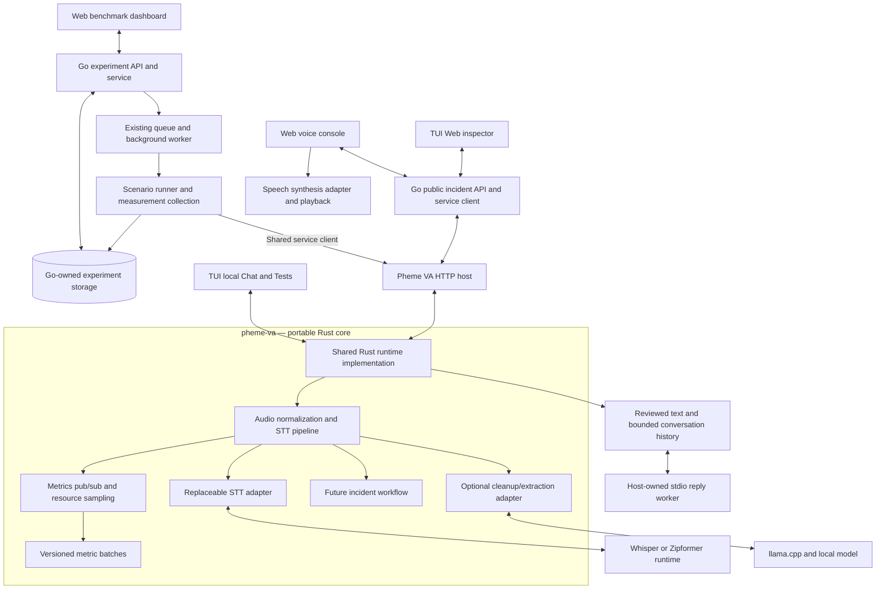
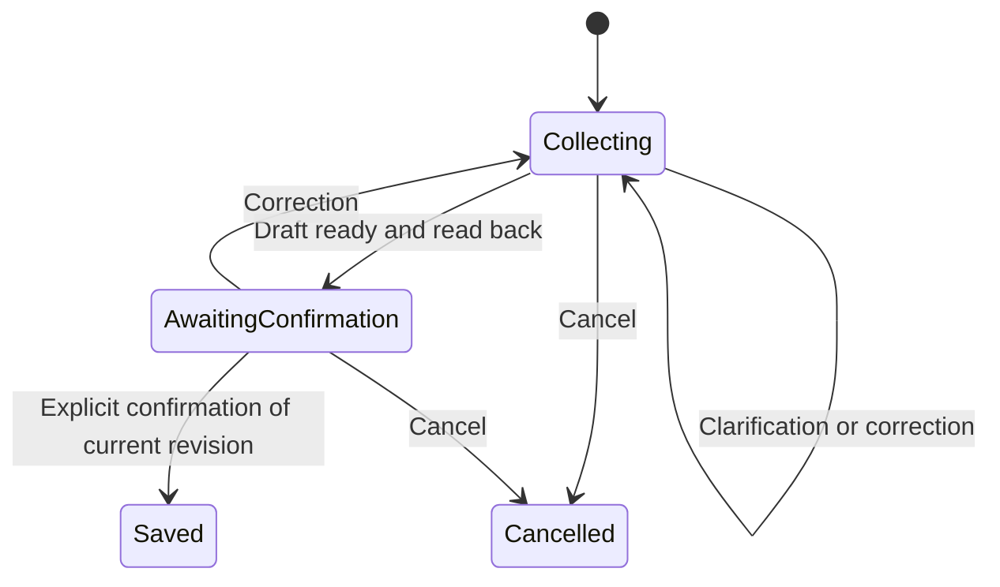

# System Architecture

This document separates the implemented foundation from the target architecture. The target workflow is intentionally described alongside the current state so that planned capabilities are not mistaken for shipped behavior.

## Implemented foundation

- `api/`: Go Gin handlers, services, models, the `IncidentAnalyzer` boundary, asynchronous benchmark lifecycle, and separate in-memory metrics ingestion. The public incident endpoint is still wired to `MockIncidentAnalyzer`; the benchmark worker still uses `MockRunner`.
- `pheme-va/`: the canonical Rust implementation. `core` owns WAV/PCM validation and normalization, mono 16 kHz conversion, speech gating, transcript guards, cleanup boundaries, model-neutral transcription, and the conservative rule-based incident extractor. `metrics` owns typed events, resource sampling, batching, and energy integration. `whispercpp` and optional `zipformer` are separate model adapters.
- `pheme-va/crates/cli/`: manifest-driven model selection, the one-shot WAV `transcribe` command, and a Ratatui TUI with onboarding, WAV browsing, microphone capture, worker-owned model switching, telemetry, structured logs, automatic allowlisted model downloads, adapter preparation, and bounded persistent run history.
- `pheme-va/crates/runtime/`: shared Rust conversation state, bounded typed event channels, snapshots, admission/idempotency, inference serialization, cancellation/timeouts, title generation and retained metrics. CLI and HTTP hosts construct separate instances from the same library.
- `pheme-va/crates/server/`: an Axum adapter with stateless STT/deterministic extraction plus web-owned review/approval, request-scoped reply SSE, recovery/inspection, cancellation/reset, and isolated reply tests. It loads manifest-selected Whisper/Zipformer and reply weights once; bounded web history remains in memory.
- `pheme-va/crates/ffi/`: a direct-path Whisper C ABI for a future native mobile host, including optional metrics-batch draining. Native audio capture and mobile lifecycle remain host responsibilities.
- `pheme-va/crates/models/reasoning/`: a normal stdio conversation adapter and `reply-native` llama.cpp worker, separate from Whisper/cleanup. Each local/HTTP host owns its persistent child, isolating incompatible GGML symbols; no extra HTTP service, reply feature flag or runtime build/download endpoint exists. Include its PID in inference resource accounting; child-specific CPU/RAM remain unavailable with the current sampler.
- `web/`: React/TypeScript/Vite/Tailwind voice console with WAV capture, transcript review, streamed answers, cancellation/reset/recovery and local-service voice playback. The benchmark page is a placeholder for the still-planned real dashboard.

### Current HTTP routes

The Go API and Rust development host are separate processes with separate route namespaces.

| Host | Method | Route                             | Current purpose                               |
| ---- | ------ | --------------------------------- | --------------------------------------------- |
| Go   | `GET`  | `/health`                         | Liveness                                      |
| Go   | `POST` | `/api/v1/incidents/analyze`       | Mock incident analysis                        |
| Go   | `POST` | `/api/v1/experiments`             | Queue a mock benchmark experiment             |
| Go   | `GET`  | `/api/v1/experiments/:id`         | Read an in-memory experiment                  |
| Go   | `POST` | `/api/v1/experiments/:id/metrics` | Append a validated metric batch               |
| Go   | `GET`  | `/api/v1/experiments/:id/metrics` | Read stored metric batches                    |
| Rust | `GET`  | `/health`                         | Liveness                                      |
| Rust | `GET`  | `/ready`                          | In-process Whisper readiness                  |
| Rust | `POST` | `/v1/transcribe`                  | Transcribe one complete WAV request           |
| Rust | `POST` | `/v1/analyze`                     | Deterministic transcript-to-report extraction |
| Rust | `GET`  | `/v1/metrics/batches`             | Drain buffered Rust metric batches            |

Go now delegates dedicated `/api/v1/voice/` routes to Pheme's `/v1/voice/` endpoints; see [voice API and limits](api/voice.md). Local TUI Chat and isolated Tests call the shared Rust runtime directly through bounded channels, retains stage runs/aggregate metrics in local read-only archives, and separately polls/approves web questions; independent tests never update conversation state. Client-side speech is implemented, not a server playback endpoint. No session/confirmation/report persistence/retrieval routes exist yet. See [the stateless API contract](api/voice-agent.md) for compatibility operations and the future confirmed-report workflow.

## Target development architecture

The web/Go/Pheme voice connection is implemented. The diagram also contains separately planned structured incident workflow, persistent storage and real benchmark-runner integration; those parts are not wired.


```mermaid
flowchart TD
    Client[Web voice console] <--> Go[Go public incident API and service client]
    Dashboard[Web benchmark dashboard] <--> Experiments[Go experiment API and service]
    Experiments <--> Results[(Go-owned experiment storage)]
    Experiments --> Queue[Existing queue and background worker]
    Queue --> Runner[Scenario runner and measurement collection]
    Runner -->|Shared service client| AgentAPI
    Go <--> AgentAPI[Pheme VA HTTP host]
    Inspector[TUI Web inspector] <--> Go
    TUI[TUI local Chat and Tests] <--> Runtime[Shared Rust runtime implementation]
    AgentAPI <--> Runtime
    Runtime --> Reply[Reviewed text and bounded conversation history]
    Reply <--> ReplyWorker[Host-owned stdio reply worker]
    subgraph RustAgent[pheme-va — portable Rust core]
        Runtime --> Core[Audio normalization and STT pipeline]
        Core --> STTAdapter[Replaceable STT adapter]
        Core --> LLMAdapter[Optional cleanup/extraction adapter]
        Core --> Draft[Future incident workflow]
        Core --> Metrics[Metrics pub/sub and resource sampling]
        Metrics --> Batch[Versioned metric batches]
    end
    STTAdapter <--> Whisper[Whisper or Zipformer runtime]
    LLMAdapter <--> LLM[llama.cpp and local model]
    Client --> TTS[Speech synthesis adapter and playback]
    Runner --> Results
```

Pheme VA replaces the previously proposed generic AI service and the removed Python runtime. Its portable core has no UI, microphone permission, or mobile lifecycle ownership. Desktop/web hosts can use the Rust HTTP wrapper or CLI; native mobile hosts can embed the Rust library through the C ABI. The core and model crates keep transcription behind traits so validated local runtimes can be compared independently.

Go calls Rust for the development voice loop, while structured incident analysis still uses `MockIncidentAnalyzer` and benchmarks still use `MockRunner`. When implemented, the benchmark runner should exercise the same Pheme VA API as interactive requests while keeping benchmark sessions and reports isolated from operational data.

The TUI engine and Chat bridge use one embedded runtime instance, one persistent reply worker and one inference gate. Model construction is shared; downloads and native build/cache preparation stay in the hosts. `--server-url` affects only Web inspection. Separate processes load separate models and keep separate sessions; sharing the library does not share memory. Typed Enter admission approves and enqueues the exact message atomically. Audio still pauses for explicit transcript review. Native leases survive cancellation/timeouts until work settles, and shutdown drains them before model drop/restart. The existing mobile C ABI remains transcription/metrics only; full Chat embedding is not yet exposed.

## Ownership and boundaries

These are target ownership boundaries for the complete system:

| Component                 | Owns                                                                                                                                         |
| ------------------------- | -------------------------------------------------------------------------------------------------------------------------------------------- |
| Go handlers/services      | Public HTTP contract, request validation, and delegation through a Pheme client                                                              |
| Go benchmark components   | Experiment configuration, queue/worker, scenario execution, scoring, and result storage                                                      |
| Go metrics repository     | Versioned metric-batch ingestion and separate metric storage                                                                                 |
| Pheme VA workflow         | Authoritative sessions/drafts, clarification, corrections, validated actions, confirmation, finalization, retrieval, and response generation |
| Pheme VA runtime adapters | Replaceable STT/LLM configuration and calls, cancellation/timeouts, and validated inference output                                           |
| Pheme VA repositories     | Incident/session persistence and atomic finalization                                                                                         |
| Rust metrics crate        | Typed events, internal subscriptions, resource-provider boundary, energy accumulation, and batch formation                                   |
| Web voice client          | Audio capture/playback, speech output, interaction status, and development inspection                                                        |
| Web dashboard             | Experiment configuration, progress, results, comparison, and export                                                                          |

The foundation list includes the development web voice loop and shared reply runtime; it does not include the complete confirmation/storage/retrieval workflow or real benchmark/dashboard implementation. Go does not currently maintain a second Pheme workflow state machine or access a Pheme database; neither service has the planned persistent incident database yet.

Keep the existing Go `IncidentAnalyzer` interface and public text endpoint. A future Pheme-backed analyzer/client should be wired in `api/cmd/server/main.go` while retaining `MockIncidentAnalyzer` for tests. Stateful session operations should use dedicated client methods rather than turning the one-shot `Analyze` contract into a stateful operation.

## Current and planned directory layout

The following paths are already present:

```text
api/                            Go public API and benchmark lifecycle
web/                            React voice console and future benchmark dashboard
pheme-va/
  crates/core/                  Portable audio, transcription and incident-analysis primitives, and adapter traits
  crates/metrics/               Typed timing/resource metric contract
  crates/cli/                   WAV client, microphone host, and TUI
  crates/server/                Development HTTP host
  crates/ffi/                   Native embedding boundary
  crates/models/
    transcription/whispercpp/   whisper.cpp model adapter
    transcription/zipformer/    Optional LiteRT Zipformer adapter
    reasoning/                  Persistent reply client
      native/                   Isolated llama.cpp worker
  prompts/                     Checked-in incident system instruction
  models/manifest.toml          Manifest model catalog
  models/README.md              Artifact sources/checksums/status
  scripts/                      Model download scripts
```

Future session/workflow modules and Pheme-owned SQLite repositories should be added only when their implementation milestones begin. Speech synthesis remains at the client/platform initially; no Python runtime, database server, distributed queue, or extra service is required for the current prototype.

## Incident workflow target

The complete voice workflow is planned as an explicit state machine owned by Pheme VA:


```mermaid
stateDiagram-v2
    [*] --> Collecting
    Collecting --> Collecting: Clarification or correction
    Collecting --> AwaitingConfirmation: Draft ready and read back
    AwaitingConfirmation --> Collecting: Correction
    AwaitingConfirmation --> Saved: Explicit confirmation of current revision
    Collecting --> Cancelled: Cancel
    AwaitingConfirmation --> Cancelled: Cancel
```

A correction must invalidate prior confirmation. Ambiguous responses must not finalize a report. Request identifiers, revision checks, and atomic state updates are required so retries or concurrent requests cannot save duplicate reports or confirm a stale draft. Spoken confirmation and any explicit confirmation control must call the same workflow logic.

The Rust server does not implement this confirmed-report state machine. Its development voice turns support transcript review, natural-language replies and bounded successful history, separately from stateless STT/deterministic extraction. Start the future workflow with text turns, then route normalized audio through the same transitions. The existing Rust metrics path already records core stage timings, model metadata, workflow outcome, retry count, transcript status, resource snapshots, and explicit unavailable values for the operations it currently wraps; stateful workflow stages will extend that contract rather than create a second metrics system.

## Proposed API and data contracts

The following routes are proposals, not currently available APIs:

| Endpoint                            | Purpose                                         |
| ----------------------------------- | ----------------------------------------------- |
| `POST /api/v1/sessions`             | Start a conversation                            |
| `POST /api/v1/sessions/:id/turns`   | Submit text or audio with a retry identifier    |
| `POST /api/v1/sessions/:id/confirm` | Confirm a specific draft revision               |
| `GET /api/v1/incidents`             | Query finalized reports using validated filters |
| `GET /api/v1/incidents/:id`         | Read one report                                 |
| `GET /api/v1/experiments`           | Paginated/filterable experiment history         |

Go should delegate session and incident operations to Pheme VA rather than duplicating transitions. Turn responses should eventually expose the transcript, reply text, state, and draft revision. Pheme VA should own incident/session records; Go should store benchmark records separately.

Planned records include sessions, ordered turns, draft revisions, confirmed reports, and execution traces. Define audio retention separately; do not retain all recordings by default. Report queries should use validated filters and parameterized repository queries, summarize only returned records, and retain record IDs for grounding checks. Time-filtered retrieval does not require embeddings or a vector database.

For report queries, the Voice Agent validates model-proposed parameters, executes parameterized SQL through its repository, then summarizes the returned records. Keep record IDs in the response/trace to verify grounding. Time-filtered retrieval does not require embeddings or a vector database.

## Runtime and device strategy

- Whisper/whisper.cpp is the current speech-recognition baseline. The optional `whispercpp` crate loads a model once and the CLI records the manifest model ID and revision in results/metrics.
- The optional `zipformer` crate implements the LiteRT Zipformer CTC adapter for the three manifest variants. Its quality, runtime, and target-device performance still require evaluation. Server and CLI support its manifest IDs when built with the existing Zipformer STT feature.
- SeaLLMs-Audio is a download-only experiment. It is not a Whisper-compatible checkpoint and has no active Pheme VA adapter.
- Conversational replies use a replaceable `ConversationModel` adapter, pinned Qwen GGUF and host-owned persistent llama.cpp stdio worker. This is not a structured extraction/cleanup adapter or additional HTTP service. Native model-backed quality/latency remain unverified.
- Speech synthesis runs client-side: browser-reported local-service voices and optional TUI `espeak`. Verify real playback and offline execution before including them in local-inference/energy claims; native mobile synthesis remains planned.
- MERaLiON and fine-tuning remain evaluation options if measured local-speech errors justify them.

A mobile phone remains the preferred eventual platform, with iOS or NVIDIA Jetson still pending confirmation. The current Linux build, CLI HTTP server, or a remote call is not evidence of on-device iOS inference. Native audio integration, Apple linking/Metal validation, signing, and physical-device tests remain future work.

Upstream references for future evaluation include [whisper.cpp](https://github.com/ggml-org/whisper.cpp), [LiteRT](https://ai.google.dev/edge/litert), and [Apple speech synthesis](https://developer.apple.com/documentation/avfaudio/avspeechsynthesizer). Pin and record versions during implementation.

## Benchmark dashboard and storage

Retain the current asynchronous Go experiment lifecycle and in-memory queue while it remains sufficient. The current runner is mocked and its result values are hardcoded; the separate metrics repository is also process-local. Planned work adds a real incident runner, measured resource integration, Go-owned persistent experiment/result storage, history/filter APIs, and dashboard comparison/export.

The dashboard will create experiments, poll progress, display quality/performance/device metrics, compare compatible configurations, and export reproducibility metadata. It must display unavailable measurements explicitly and flag differing datasets or measurement scopes instead of ranking incomparable runs silently. The operational focus on speech does not remove this visual research interface.

No distributed queue, additional database service, or top-level benchmark service is required by this plan. Keep Go unit tests beside their packages, Rust tests beside the relevant crate, and cross-service scenarios under `tests/`; the fake-backed voice check does not load weights.
