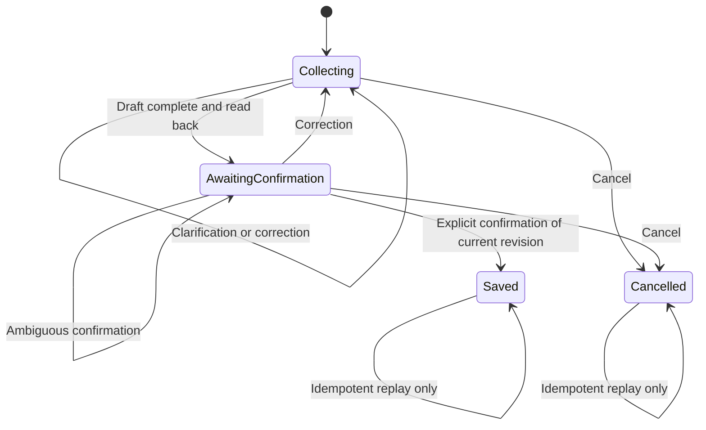

# Pheme VA Server Incident Workflow Plan

## Purpose

This plan describes the server-side implementation of the voice-based incident-reporting workflow inside Pheme VA.

The goal is to evolve the current stateless Rust HTTP host into the authoritative workflow service for:

- WAV upload and transcription
- Incident draft creation
- Clarification questions
- Corrections and revised drafts
- Explicit human confirmation
- Safe report finalization and persistence
- Incident/report retrieval
- Validated, auditable action proposals and future action execution

The implementation boundary is `pheme-va/`. The Go API, web console, mobile host, and speech-synthesis clients may consume the HTTP contracts defined here, but their implementation is outside this plan.

## Current state

The server currently exposes:

```text
GET  /health
GET  /ready
POST /v1/transcribe
POST /v1/analyze
GET  /v1/metrics/batches
```

Current behavior is stateless:

- `/v1/transcribe` accepts one complete WAV request and returns a `TranscriptionResult`.
- `/v1/analyze` accepts a transcript and returns a deterministic `IncidentReport`.
- `/v1/analyze` does not create a session, save a report, ask clarification questions, or execute `recommended_action`.
- `/v1/metrics/batches` drains in-memory metrics; it is not incident storage or log persistence.
- There is no session state, confirmation endpoint, report repository, action executor, or incident retrieval route.

The existing routes should remain backwards compatible while the stateful workflow is added as new routes.

## Design principles

1. **Pheme owns workflow state.** The Rust service is authoritative for sessions, drafts, revisions, confirmation, finalization, actions, and report retrieval.
2. **Keep host concerns in the server and domain concerns in core.** HTTP extraction, response mapping, and runtime wiring belong in `crates/server`; portable state transitions and validation should live in `crates/core` where practical.
3. **Model output is untrusted input.** A model may propose fields, clarification questions, or actions, but it cannot bypass workflow validation or execute arbitrary operations.
4. **Confirmation is revision-bound.** Confirmation must refer to the exact draft revision that was read back. Any material correction invalidates prior confirmation.
5. **Retries must be safe.** Every state-changing request needs an idempotency/request ID. Replaying a request must not create duplicate turns, reports, or actions.
6. **Persist authoritative records in Pheme-owned SQLite.** Go must access incident data through Pheme HTTP contracts rather than accessing Pheme tables directly.
7. **Do not retain raw audio by default.** Store transcript and timing metadata unless an explicit retention requirement is added.
8. **Keep actions bounded and explicit.** Start with validated action proposals and an audit-only executor; add real integrations only behind an adapter and explicit policy.
9. **Prefer explicit state transitions.** Do not introduce LangGraph or another orchestration framework for the initial implementation.
10. **Make unavailable measurements explicit.** Metrics and workflow traces must preserve `null` plus a reason instead of representing unavailable data as zero.

## Target workflow



### Session states

- `collecting`: The service is gathering or correcting incident information.
- `awaiting_confirmation`: A complete draft has been read back and is waiting for explicit confirmation.
- `saved`: The current revision has been confirmed and finalized exactly once.
- `cancelled`: The session has been cancelled and cannot be finalized.
- `expired`: Optional later state for session retention cleanup; it must never silently become a saved report.

### Draft revisions

Each material change creates a new monotonically increasing `draft_revision`:

- A new extracted fact creates a revision.
- A clarification answer creates a revision.
- A correction creates a revision.
- A formatting-only change does not create a revision unless it changes the read-back content.
- A new revision invalidates any previous confirmation.

The persisted draft should retain enough history to explain what was confirmed. Do not overwrite the only copy of a previously read-back revision.

## Workflow stages

### Stage 1: Create a session

Create a Pheme-owned session before the first turn.

The session response should include:

```json
{
  "session_id": "sess_01H...",
  "state": "collecting",
  "draft_revision": 0,
  "created_at": "2026-09-17T12:00:00Z"
}
```

The session should record:

- Stable session ID
- Creation and last-activity timestamps
- Current workflow state
- Current draft revision
- Retention/expiry metadata
- Optional client correlation metadata that does not contain secrets

### Stage 2: Submit a turn

A turn may contain text or one complete WAV file.

The implementation should support both forms without requiring clients to duplicate the workflow:

- `Content-Type: application/json` for text input
- `Content-Type: audio/wav` or `audio/x-wav` for raw WAV input

Text request example:

```json
{
  "request_id": "turn-01H...",
  "expected_revision": 0,
  "text": "There is smoke near the west entrance."
}
```

Audio requests should use the raw WAV body and carry workflow metadata in validated headers or a clearly defined query/envelope mechanism. The preferred initial contract is:

```http
POST /v1/sessions/{session_id}/turns
Content-Type: audio/wav
X-Request-ID: turn-01H...
X-Expected-Revision: 0
```

Do not use base64 JSON or multipart upload unless a client requirement makes raw audio impossible. Reuse the existing core audio pipeline and duration limit.

The turn handler should:

1. Validate the session and expected revision.
2. Check request idempotency before doing model work.
3. Transcribe audio when the body is WAV.
4. Preserve the transcript and transcription metadata.
5. Extract or update a structured incident draft.
6. Validate the proposed draft against workflow rules.
7. Create a new draft revision if facts changed.
8. Determine whether clarification is required.
9. Read back the draft or ask a concise clarification question.
10. Persist the turn, resulting state, and response atomically.
11. Store the idempotent response for safe retry replay.

A turn response should contain:

```json
{
  "session_id": "sess_01H...",
  "request_id": "turn-01H...",
  "replayed": false,
  "transcript": "There is smoke near the west entrance.",
  "reply_text": "What is the severity of the incident?",
  "state": "collecting",
  "draft_revision": 1,
  "draft": {
    "incident_type": "smoke report",
    "location": "the west entrance",
    "severity": null,
    "summary": "Smoke was reported near the west entrance.",
    "recommended_action": null
  },
  "clarification": {
    "field": "severity",
    "question": "What is the severity of the incident?"
  },
  "report_id": null
}
```

The exact completeness policy must be explicit and configurable. The first implementation should not silently invent values. Missing facts should remain absent or use the domain's explicit `unknown` representation, depending on whether the field is incomplete or finalized.

### Stage 3: Clarification

When required information is missing or ambiguous:

- Remain in `collecting`.
- Return one clear clarification question.
- Identify the field or ambiguity being clarified.
- Do not finalize a report.
- Do not execute a recommended action.

Examples:

- Missing location → ask for the location.
- “Smoke or fire?” → preserve the uncertainty and ask a targeted question.
- Conflicting locations → ask which location is correct.
- Missing severity → ask for severity if the completeness policy requires it.

Clarification answers are ordinary turns. They must use the same idempotency, revision, and persistence rules as initial turns.

### Stage 4: Correction

A correction must create a new draft revision and invalidate prior confirmation.

Example:

```text
User: The west gate.
Agent: Please confirm: smoke at the west gate, low severity.
User: Correction, the east gate.
```

Expected behavior:

1. Move back to `collecting` if currently awaiting confirmation.
2. Create a new revision.
3. Replace only the corrected fact.
4. Preserve the previous revision in history.
5. Read back the revised draft.
6. Require confirmation of the new revision.

A correction must never update a finalized report silently. After `saved`, a correction requires a separate amendment workflow, which is out of scope for the initial implementation.

### Stage 5: Confirmation

Add an explicit confirmation endpoint:

```http
POST /v1/sessions/{session_id}/confirm
Content-Type: application/json
```

Request:

```json
{
  "request_id": "confirm-01H...",
  "draft_revision": 3,
  "confirmation": "confirmed"
}
```

Only an explicit positive confirmation of the current revision may finalize the report. Responses such as `maybe`, `I think so`, silence, or unrelated text must not finalize it.

Successful response:

```json
{
  "session_id": "sess_01H...",
  "request_id": "confirm-01H...",
  "state": "saved",
  "draft_revision": 3,
  "report_id": "report_01H...",
  "saved_at": "2026-09-17T12:04:00Z",
  "replayed": false
}
```

A stale revision must return a conflict and must not save:

```json
{
  "error": {
    "code": "stale_revision",
    "message": "The draft has changed; confirm the current revision."
  }
}
```

Finalization must be transactional and idempotent. Repeating the same confirmation request returns the original result. Reusing a request ID with a different payload returns a conflict.

### Stage 6: Cancellation

Add a cancellation operation so a user can explicitly abandon a draft:

```http
POST /v1/sessions/{session_id}/cancel
Content-Type: application/json
```

Request:

```json
{
  "request_id": "cancel-01H...",
  "draft_revision": 2
}
```

Cancellation must be idempotent and must never create a report. A cancelled session cannot accept ordinary turns unless a new session is created.

## HTTP API plan

The following routes are additive to the current server API:

| Method | Route | Purpose |
| --- | --- | --- |
| `POST` | `/v1/sessions` | Create a session |
| `GET` | `/v1/sessions/{id}` | Read current session state and draft |
| `POST` | `/v1/sessions/{id}/turns` | Submit text or raw WAV input |
| `POST` | `/v1/sessions/{id}/confirm` | Confirm the current draft revision |
| `POST` | `/v1/sessions/{id}/cancel` | Cancel a session |
| `GET` | `/v1/sessions/{id}/turns` | Retrieve persisted turn history, subject to retention policy |
| `GET` | `/v1/incidents` | Query finalized reports with bounded filters |
| `GET` | `/v1/incidents/{id}` | Retrieve one finalized report |
| `GET` | `/v1/incidents/{id}/events` | Retrieve persisted workflow/audit events if enabled |

The existing routes remain:

- `/v1/transcribe` for stateless transcription and compatibility.
- `/v1/analyze` for stateless development analysis and compatibility.
- `/v1/metrics/batches` for the existing in-memory metrics drain.

### Request identity and concurrency headers

State-changing requests require:

- `request_id`: stable client-generated idempotency key.
- `expected_revision`: the draft revision the caller read.
- `session_id`: path identifier.

The server must reject:

- Missing request IDs.
- Reuse of a request ID with a different request body.
- Stale expected revisions.
- Requests against saved or cancelled sessions where the operation is invalid.

Use `409 Conflict` for stale revisions, conflicting idempotency reuse, and invalid state transitions. Use `404 Not Found` for unknown sessions or reports. Use `422 Unprocessable Entity` for structurally valid but semantically invalid input.

### Error envelope

New workflow routes should use one stable error shape:

```json
{
  "error": {
    "code": "invalid_transition",
    "message": "The session is already saved."
  },
  "request_id": "turn-01H..."
}
```

Do not expose database errors, model prompts, raw model output, local file paths, or internal stack traces.

Recommended initial error codes:

- `invalid_request`
- `unsupported_media_type`
- `audio_too_long`
- `invalid_audio`
- `session_not_found`
- `report_not_found`
- `stale_revision`
- `invalid_transition`
- `idempotency_conflict`
- `runtime_unavailable`
- `workflow_timeout`
- `invalid_model_proposal`
- `action_not_allowed`
- `storage_failure`

## Domain model

Introduce explicit domain types rather than passing loosely shaped JSON between handlers:

```rust
struct SessionId(String);
struct RequestId(String);
struct ReportId(String);
struct DraftRevision(u64);

enum SessionState {
    Collecting,
    AwaitingConfirmation,
    Saved,
    Cancelled,
    Expired,
}
```

The initial draft should preserve explicit facts and uncertainty:

```rust
struct IncidentDraft {
    incident_type: Option<String>,
    location: Option<String>,
    severity: Option<Severity>,
    summary: Option<String>,
    recommended_action: Option<String>,
    uncertainty: Vec<Uncertainty>,
}
```

Avoid using a free-form model-generated action string as an executable command. Represent supported actions as a closed type:

```rust
enum ActionProposal {
    NotifyRole { role: AllowedRole },
    RecordOnly,
}
```

The initial implementation may expose action proposals in responses while using an audit-only executor. Real notification or emergency adapters require a separate acceptance decision and integration contract.

## Persistence design

Add Pheme-owned SQLite storage. The Go backend must not read these tables directly.

### Suggested tables

#### `sessions`

- `id` primary key
- `state`
- `current_revision`
- `created_at`
- `updated_at`
- `expires_at`
- optional client correlation metadata

#### `turns`

- `id` primary key
- `session_id`
- `request_id`
- unique `(session_id, request_id)`
- input type
- transcript
- raw audio metadata, if retained
- resulting state
- resulting revision
- reply text
- created_at
- serialized response for idempotent replay

#### `draft_revisions`

- `session_id`
- `revision`
- structured draft fields
- clarification metadata
- source turn ID
- created_at
- unique `(session_id, revision)`

#### `reports`

- `id` primary key
- `session_id`
- confirmed revision
- finalized draft fields
- recorded-at timestamp
- confirmed-at timestamp
- created-at timestamp
- unique finalized report constraint for the session/revision policy

#### `workflow_events`

- event ID
- session/report ID
- request ID
- event type
- revision
- timestamp
- structured event data

Use migrations checked into the repository. Apply state transitions, revision creation, confirmation, and report finalization in transactions. Add indexes for session ID, request ID, report ID, recorded-at time, and workflow event time.

The storage implementation may use synchronous SQLite calls behind `spawn_blocking` if that keeps the dependency and transaction model simple. Do not hold a database mutex across model inference. Model work should happen before the short persistence transaction, with the expected revision checked again inside the transaction.

## Action and emergency safety

Emergency behavior must be implemented as a controlled integration boundary, not as arbitrary model output.

### Action proposal pipeline

1. Extract a typed proposal from the transcript/model output.
2. Validate the proposal against an allowlist and current session state.
3. Store the proposal and validation result in the workflow event log.
4. Present the proposal in the read-back response.
5. Require explicit confirmation of the current draft and action scope.
6. Invoke an `ActionExecutor` trait only for supported actions.
7. Use an action idempotency key derived from session, report, revision, and action request ID.
8. Persist the execution result, including unavailable or failed outcomes.

The initial default executor should be audit-only/no-op so development cannot accidentally send notifications or trigger emergency infrastructure. A real executor must have bounded timeouts, cancellation behavior, sanitized error responses, and tests using a local fake.

The server must never allow a transcript such as “call this arbitrary URL” to become an unrestricted network operation.

## Retrieval and logs

The workflow needs persisted turn/report history, but that is different from process logs and metrics:

- `GET /v1/sessions/{id}/turns` returns bounded, authorized workflow turns.
- `GET /v1/incidents` returns finalized reports using validated filters and a maximum limit.
- `GET /v1/incidents/{id}` returns one persisted report.
- `GET /v1/incidents/{id}/events` may return workflow audit events for development and benchmark inspection.
- `/v1/metrics/batches` remains the telemetry drain and is not a log search endpoint.
- Rust stdout/stderr should not be treated as an API data source.

For incident queries:

- Use parameterized SQL only.
- Define UTC timestamp behavior.
- Use inclusive `from` and exclusive `to` bounds.
- Return newest first with a stable ID tie-breaker.
- Enforce a server-side maximum limit.
- Return record IDs in any generated summary so consumers can verify grounding.
- Summarize only records actually returned by the repository.

## Runtime and resource handling

Reuse the preloaded transcription engine. Do not load model weights for every turn.

Add bounded controls for workflow requests:

- Maximum WAV duration and body size.
- Maximum transcript length.
- Maximum clarification/turn count per session.
- Model inference timeout.
- Storage transaction timeout.
- Session expiry.
- Maximum retrieval limit.
- Cancellation propagation where the model adapter supports it.

The existing server uses a shared `Mutex<Engine>`, which serializes model-backed transcription. Keep this behavior initially unless measurements justify a bounded worker pool. Do not add unbounded concurrency around a large local model.

Record metrics for:

- Audio normalization
- Speech gating
- Transcription
- Incident extraction
- Clarification decision
- Persistence transaction
- End-to-end turn
- Confirmation/finalization
- Action execution, including unavailable measurements

Use the existing `MetricsContext` correlation fields. Do not put metrics inside the public report response.

## Implementation phases

### Phase 1: Freeze contracts and domain rules

- Add this plan's state and endpoint contract to server documentation.
- Define the draft completeness policy.
- Define severity and action allowlists.
- Define request ID, revision, conflict, and replay semantics.
- Decide raw audio retention policy.
- Add typed core domain models and transition functions.

Exit criteria:

- State transition table is reviewed.
- Invalid transitions and stale revisions have defined error codes.
- No model output can directly finalize or execute an action.

### Phase 2: Implement the workflow domain

- Add a session/workflow module under `crates/core`.
- Implement draft revision creation and correction invalidation.
- Implement clarification selection.
- Implement confirmation and cancellation rules.
- Keep the module independent of Axum and SQLite.
- Add deterministic fake analyzers and clocks for tests.

Exit criteria:

- Core tests cover every valid transition and representative invalid transition.
- A correction after read-back requires a new confirmation.
- Ambiguous confirmation does not save.

### Phase 3: Add SQLite persistence

- Add a Pheme-owned SQLite repository.
- Add migrations for sessions, turns, drafts, reports, and workflow events.
- Implement transactional revision and finalization operations.
- Store idempotent request results.
- Add restart and concurrent-finalization tests.

Exit criteria:

- A confirmed revision saves exactly one report.
- Replaying the same request returns the same result.
- Reusing an ID with a different payload returns a conflict.
- A stale confirmation never saves.

### Phase 4: Add HTTP session routes

- Add session creation and session status handlers.
- Add text and raw-WAV turn handling.
- Reuse existing WAV normalization/transcription behavior.
- Add confirmation and cancellation handlers.
- Add consistent workflow error mapping.
- Keep `/v1/transcribe` and `/v1/analyze` backwards compatible.

Exit criteria:

- A WAV can pass through transcription, extraction, clarification, correction, read-back, and confirmation using only the Rust server API.
- HTTP tests verify content types, body limits, status codes, response schemas, retries, and conflicts.

### Phase 5: Add retrieval and audit events

- Add session turn retrieval.
- Add bounded incident list and single-report retrieval.
- Add optional workflow event retrieval.
- Add validated time and limit filters.
- Ensure responses contain only repository results.

Exit criteria:

- Reports survive server restart.
- Unknown IDs return controlled `404` errors.
- Queries cannot access another session through untrusted SQL/filter input.

### Phase 6: Add safe action boundary

- Add `ActionExecutor` and audit-only default implementation.
- Validate typed action proposals.
- Add explicit confirmation requirements for action execution.
- Add idempotent execution records.
- Add local fake executor tests.

Exit criteria:

- No action executes before the required confirmation.
- Duplicate requests cannot execute an action twice.
- Unsupported or ambiguous actions are rejected without side effects.

### Phase 7: Benchmark and harden

- Add stage metrics to the workflow.
- Measure end-to-end latency, memory, CPU, and model behavior.
- Test cancellation, concurrent sessions, database locks, and restart behavior.
- Review retention and privacy of transcript/report data.
- Update the server README and API examples from the implemented behavior.

## Testing strategy

Tests must use local fakes or small generated fixtures by default. They must not require committed model weights or recordings.

### Core tests

- Session starts in `collecting`.
- Missing required fields produce a clarification.
- Clarification answers update the expected field.
- Corrections increment the revision.
- Corrections invalidate confirmation.
- Complete drafts enter `awaiting_confirmation`.
- Ambiguous confirmation remains unconfirmed.
- Explicit current-revision confirmation enters `saved`.
- Stale confirmation returns a conflict.
- Cancellation never creates a report.
- Saved/cancelled sessions reject invalid later transitions.

### Audio tests

- Valid WAV input reaches the workflow.
- Mono/stereo and supported sample formats normalize correctly.
- Silent audio produces a controlled no-speech turn.
- Malformed and unsupported WAVs return a client error.
- Duration and body limits are enforced.
- A transcription failure does not partially persist a turn.

### Persistence tests

- Migrations create the expected schema.
- Session and revision reads are ordered and bounded.
- Finalization is atomic.
- Duplicate request replay returns the original response.
- Conflicting request reuse is rejected.
- Concurrent finalization creates one report.
- Data survives repository/server restart.

### HTTP tests

- Verify every route's request and response shape.
- Verify content-type handling for JSON and raw WAV turns.
- Verify `400`, `404`, `409`, `415`, `422`, `500`, `502`, and `503` mappings.
- Verify request IDs and expected revisions.
- Verify no raw model output, local paths, or database errors leak in responses.
- Verify metrics are correlated with session, request, and revision IDs.

Run the Rust checks from `pheme-va/`:

```bash
cargo fmt --all -- --check
cargo clippy --workspace --all-targets -- -D warnings
cargo test --workspace
```

## Out of scope for this plan

- Go API implementation or Go-to-Pheme client wiring
- Web voice console and dashboard changes
- iOS/Android audio hosts or FFI changes
- Speech synthesis implementation
- Distributed queues, Redis, Kafka, PostgreSQL, Docker, or additional services
- Automatic cloud emergency integrations
- Storing all raw recordings by default
- Replacing the explicit workflow with LangGraph

The server should first implement and validate the local Rust workflow and its HTTP contract. Other hosts can then call the same Pheme endpoints without duplicating workflow state or confirmation rules.

## Completion criteria

The server-side workflow is complete for the initial release when:

1. A client can create a session and submit a WAV without separately implementing the workflow.
2. Pheme transcribes the audio and creates a validated incident draft.
3. Missing or ambiguous information produces clarification instead of invented facts.
4. Corrections create new revisions and invalidate earlier confirmation.
5. Only explicit confirmation of the current revision finalizes a report.
6. Finalization is transactional, durable, and idempotent.
7. Reports and bounded workflow history can be retrieved through Pheme HTTP routes.
8. Proposed actions are validated and auditable, with no unrestricted side effects.
9. Metrics identify the session, request, revision, and workflow stages.
10. The full deterministic test suite passes without model weights or external services.
