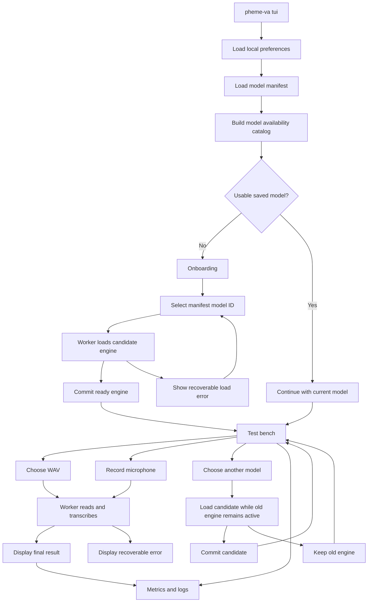

# Pheme VA TUI Implementation Plan

## Status

The baseline described by this document is implemented in `pheme-va/crates/cli/`. The TUI now has a worker/event-loop architecture, manifest model selection, model switching and preparation, WAV and microphone input, metrics, logs, and bounded persistent run history. The remaining sections describe the implemented behavior and the enhancements that should be added without changing the Pheme core boundary.

## Purpose

This document describes the Rust terminal user interface for Pheme VA. It is an implementation reference rather than a list of numbered phases.

The TUI is a local developer and model-evaluation console. It lets users select a manifest-defined speech model, send it individual WAV files or microphone recordings, read the final transcript, and inspect the detailed behavior of each run. It is not a replacement for the production web console, the Go API, the Pheme VA server, or the mobile FFI host.

The onboarding experience is inspired by the useful parts of OpenClaw's setup flow: make first-run configuration explicit, explain what is happening, keep the current working configuration on later launches, and provide a clear reconfiguration path. The implementation should not copy OpenClaw's runtime or introduce a dependency on it.

## What exists today

The relevant code is under `pheme-va/`:

- `crates/cli/src/main.rs` contains the current `tui` and `transcribe` commands, microphone capture, and WAV transcription wiring.
- `crates/cli/src/model.rs` loads `models/manifest.toml`, resolves a model ID, and constructs an `Engine` using the model's `family`.
- `crates/core/` owns audio normalization, speech gating, transcription, transcript guards, and the shared `Transcriber` boundary.
- `crates/metrics/` provides typed `MetricEvent`, `MetricSample`, `MetricsContext`, `MetricsHub`, `ResourceCollector`, and the desktop `SysinfoResourceSampler`.
- `crates/models/whispercpp/` and `crates/models/zipformer/` are separate optional model adapters.
- The current TUI starts a Ratatui event loop, owns a worker for model loading and transcription, supports multiple WAV/microphone runs, exposes telemetry and logs, and stays open until the user exits. Completed and failed run reports are also persisted in bounded local JSON history.

The current model manifest contains:

| ID                       | Family      | Runtime metadata | Artifact(s)                     | Timestamps | Streaming |
| ------------------------ | ----------- | ---------------- | ------------------------------- | ---------: | --------: |
| `whisper-large-v3-turbo` | `whisper`   | `whispercpp`     | Whisper model file              |        yes |        no |
| `zipformer-small`        | `zipformer` | `litert`         | TFLite model, tokenizer, tokens |         no |        no |
| `zipformer-medium`       | `zipformer` | `litert`         | TFLite model, tokenizer, tokens |         no |        no |
| `zipformer-large`        | `zipformer` | `litert`         | TFLite model, tokenizer, tokens |         no |        no |

The `runtime` field is useful metadata for the UI, but the current loader dispatches by `family`. The TUI must preserve this distinction rather than treating `whispercpp` or `litert` as the dispatch key.

`core::Transcriber` exposes `name()`, `model_family()`, `model_revision()`, `is_ready()`, and full-clip `transcribe(...)`. `Engine::with_boxed_config` allows the CLI to construct an engine around a boxed adapter. `Engine` does not currently expose `set_transcriber`, `reload`, or `swap`.

## Model selection and swapping: the current reality

The CLI supports model selection through the manifest at startup, and the TUI also supports selecting another model while it is running. If the requested adapter is compiled into the current binary, the worker loads and commits the replacement engine without changing the core `Engine` API. If the adapter is not compiled, the TUI prepares a cached feature-enabled executable and restarts after restoring the terminal.

Run the commands below from `pheme-va/`.

### Whisper

```bash
cargo run --release -p cli --features whisper -- \
  --stt-model whisper-large-v3-turbo \
  --model-manifest models/manifest.toml \
  tui
```

### Zipformer

```bash
./scripts/download-model.sh zipformer-small

cargo run --release -p cli --features zipformer -- \
  --stt-model zipformer-small \
  --model-manifest models/manifest.toml \
  tui
```

### One binary containing both model families

```bash
cargo run --release -p cli --features 'whisper,zipformer' -- \
  --model-manifest models/manifest.toml \
  --stt-model whisper-large-v3-turbo \
  tui
```

A binary built with both features can select either family through `--stt-model`. A binary built with only one feature can prepare the missing adapter automatically from the model picker; the picker reports the preparation state and the TUI restarts into the cached feature-enabled executable after a successful build. Existing settings and saved run reports are retained across that restart, while in-memory live metrics and logs are not.

There is currently no `switch-model`, reload, HTTP model-switch, or FFI reload command. The server still uses a direct Whisper model path, and the FFI is still direct-path Whisper based. Those hosts should not be confused with the TUI's worker-side model selection and adapter-preparation path.

The TUI can support live switching without changing `core`:

1. Keep the active `Engine` inside an inference worker.
2. Receive a `SwitchModel` command containing a manifest ID.
3. Call the existing `model::create_engine(...)` in the worker.
4. Check that the candidate engine is ready.
5. Replace the active engine only after successful construction and validation.
6. Keep the old engine if construction fails.

Both model families must be compiled into the CLI binary for cross-family switching. The old engine remains allocated while the candidate loads, so the UI and telemetry must make the temporary memory increase visible.

## End-to-end runtime flow



The UI event loop must start before model loading so the terminal remains responsive and loading progress can be displayed. The event loop owns presentation state; the worker owns the model runtime and all blocking model operations.

## First launch and onboarding

At startup, the `tui` command shows the Welcome screen only for first-run or explicit reconfiguration:

- no saved TUI configuration exists and no explicit model override was supplied; or
- `--reconfigure` was supplied.

A saved configuration that names an unavailable model is handled by the picker rather than treated as onboarding. In particular:

- a manifest that cannot be loaded uses the Error screen;
- an unknown saved model, missing artifacts, or an unavailable adapter goes to the picker;
- a missing adapter may be prepared automatically from the picker; and
- model-load failures are recoverable and are not persisted as a startup condition.

On a later launch with a valid saved configuration, show a short entry menu instead of forcing setup again:

```text
┌─ PHEME VA / START ──────────────────────────────────────────────────────────┐
│                                                                              │
│  Current model: whisper-large-v3-turbo                                      │
│  Manifest:      models/manifest.toml                                        │
│  Audio folder:  pheme-va/samples/                                      │
│                                                                              │
│  > Continue with current model                                              │
│    Choose another model                                                      │
│    Change audio folder                                                       │
│    Open settings                                                             │
│                                                                              │
│  [↑/↓] select  [Enter] open  [r] reconfigure  [Esc] exit                    │
└──────────────────────────────────────────────────────────────────────────────┘
```

The first-run welcome screen should explain that the TUI is a local test bench, what will be configured, and that no audio is sent to a remote service by this host:

```text
┌─ PHEME VA / FIRST-RUN SETUP ────────────────────────────────────────────────┐
│                                                                              │
│  Local speech transcription test bench                                      │
│                                                                              │
│  The setup will:                                                            │
│    1. Load the model manifest                                               │
│    2. Show which models can run in this binary                              │
│    3. Let you choose a model ID                                             │
│    4. Configure a local WAV folder and microphone workflow                  │
│    5. Open the transcription test bench                                     │
│                                                                              │
│  Audio remains on this machine when using the local CLI.                    │
│                                                                              │
│  [Enter] continue    [Esc] exit                                             │
└──────────────────────────────────────────────────────────────────────────────┘
```

Onboarding should not primarily browse arbitrary model files. The model picker selects a manifest ID. Adding a new model means adding a manifest entry and making its adapter/artifacts available; the audio folder browser is a separate workflow.

### Manifest model catalog

The picker should load `ModelManifest` and display one row per manifest entry. Each entry needs independent status fields:

```text
Manifest entry       present
Family adapter       compiled / not compiled
Required artifacts   available / missing
Load status          not tested / ready / failed
Checksum metadata    declared / absent / not verified
```

A model with a file on disk is not automatically a valid active model. The catalog should check the primary artifact and, for Zipformer, tokenizer and token files. The worker's real load attempt remains the final readiness check.

Example:

```text
┌─ PHEME VA / SELECT SPEECH MODEL ────────────────────────────────────────────┐
│ Manifest: models/manifest.toml                                              │
│ Select a manifest ID. The candidate is not activated until it loads.        │
├──────────────────────────────────────────────────────────────────────────────┤
│                                                                              │
│ > whisper-large-v3-turbo                                                     │
│   Family: whisper       Runtime: whispercpp       Revision: 5359861c...      │
│   Artifact: available   Adapter: compiled          Size: approximately 1.62 GB│
│   Timestamps: yes      Streaming: no                                        │
│                                                                              │
│   zipformer-small                                                            │
│   Family: zipformer     Runtime: litert            Revision: 7732ad6c...     │
│   Artifacts: available  Adapter: compiled          Size: approximately 46 MB │
│   Timestamps: no       Streaming: no                                        │
│                                                                              │
│   zipformer-medium                                                           │
│   Family: zipformer     Runtime: litert                                      │
│   Artifacts: found      Adapter: not compiled                                │
│   Rebuild with: --features zipformer                                        │
│                                                                              │
├──────────────────────────────────────────────────────────────────────────────┤
│ [↑/↓] select  [Enter] load  [r] rescan  [Esc] back                           │
└──────────────────────────────────────────────────────────────────────────────┘
```

The UI should show the complete artifact path in a details pane or when the entry is selected. Paths should be resolved using the same helper as `model::create_engine(...)`; the TUI must not duplicate manifest path semantics.

The manifest contains SHA-256 metadata. The CLI loader and picker use the metadata for model identity and artifact status but do not verify checksums during ordinary loading. The allowlisted model downloader does verify SHA-256 before promoting a downloaded artifact. The UI must distinguish an artifact downloaded and verified by that task from an arbitrary file that merely exists on disk; a future load-time integrity check can add verification without changing the selector contract.

### Model load result

Loading happens after the user chooses an ID and is represented as a worker operation:

```text
┌─ PHEME VA / LOADING MODEL ───────────────────────────────────────────────────┐
│ Model ID:  zipformer-small                                                   │
│ Family:    zipformer                                                         │
│ Runtime:   litert                                                            │
│                                                                              │
│ Loading candidate engine in the inference worker...                         │
│                                                                              │
│ The terminal remains responsive.                                             │
└──────────────────────────────────────────────────────────────────────────────┘
```

A successful load should show:

```text
┌─ MODEL READY ────────────────────────────────────────────────────────────────┐
│ Model:       zipformer-small                                                  │
│ Family:      zipformer                                                        │
│ Runtime:     litert                                                           │
│ Runtime ready: YES                                                            │
│ Load time:   184 ms                                                           │
│                                                                              │
│ Speech smoke test: not run                                                   │
│                                                                              │
│ [Enter] enter test bench  [r] retry  [m] choose another model                │
└──────────────────────────────────────────────────────────────────────────────┘
```

The model load is required before the model becomes active. A speech smoke test may be offered when a WAV is present, but the UI must distinguish `model loaded`, `speech verified`, `speech test not run`, and `speech test failed`.

Configuration should only be written after the candidate model loads successfully. A failed candidate must not overwrite the saved working model.

## Main test bench

The central result panel is always visible so both file and microphone runs end in the same prominent transcript component.

```text
┌─ PHEME VA / TEST BENCH ──────────────────────────────────────────────────────┐
│ Model: whisper-large-v3-turbo   Family: whisper   Runtime: whispercpp READY  │
│ Manifest: models/manifest.toml                                               │
├────────────────────────┬─────────────────────────────────────────────────────┤
│ INPUT SOURCE           │ FINAL TRANSCRIPT                                    │
│                        │                                                     │
│ [l] Live microphone    │ No result yet.                                      │
│ [f] Select WAV file    │ Choose a source to test the selected model.         │
│                        │                                                     │
│ Folder:               │                                                     │
│ pheme-va/samples/ │                                                     │
├────────────────────────┴─────────────────────────────────────────────────────┤
│ RUN DETAILS                                                                  │
│ Status: idle       Source: none       Run: —       Last run: —               │
├──────────────────────────────────────────────────────────────────────────────┤
│ METRICS                                                                      │
│ normalization: —  gate: —  transcription: —  end-to-end: —                   │
├──────────────────────────────────────────────────────────────────────────────┤
│ [r] retry  [n] next file  [f] folder  [l] live                              │
│ [m] model  [t] metrics/logs  [j/k] scroll  [?] help  [q] quit               │
└──────────────────────────────────────────────────────────────────────────────┘
```

[t] opens the metrics and logs workspace. It is separate from the compact metrics summary and can be opened while a model is loading, while a request is processing, or after a completed run. The workspace has `Overview`, `Metrics`, `Runs`, and `Logs` tabs. [j/k] scrolls or selects within the focused panel; arrow keys remain available for lists and tabs.

The main screen should expose these states explicitly:

- `idle` — no active operation;
- `loading_model` or `switching_model`;
- `recording`;
- `reading_audio`;
- `processing`;
- `result`;
- `no_speech` or another valid transcription status;
- `error` — recoverable operation failure.

## WAV test flow

### Select a file

Press `[f]` to open the configured audio directory:

```text
┌─ PHEME VA / SELECT WAV FILE ────────────────────────────────────────────────┐
│ Directory: /home/user/project/pheme-va/samples/                         │
├──────────────────────────────────────────────────────────────────────────────┤
│                                                                              │
│ ..                                                                           │
│ > incident-001.wav                                                          │
│   incident-002.wav                                                          │
│   silence.wav                                                               │
│                                                                              │
│ Only WAV files are supported by the MVP.                                   │
│                                                                              │
├──────────────────────────────────────────────────────────────────────────────┤
│ [↑/↓] move  [Enter] transcribe  [d] change directory  [Esc] back             │
└──────────────────────────────────────────────────────────────────────────────┘
```

The browser should provide:

- parent-directory navigation;
- an explicit directory-change action;
- deterministic, case-insensitive `.wav` sorting;
- empty-directory and unreadable-directory messages;
- the selected file's duration or size when available;
- `[n]` next-file behaviour based on the sorted current file list;
- clear rejection of unsupported formats.

The MVP should not automatically run every file. Each file is an individual run with its own run ID, transcript, status, and metric history.

### Process the file

After `Enter`, the worker should read the bytes, construct `AudioBuffer::from_wav(...)`, and call the engine with a fresh metrics context. The UI should not call a blocking model method.

```text
┌─ PHEME VA / PROCESSING WAV ─────────────────────────────────────────────────┐
│ Source: incident-001.wav                                                    │
│ Run:    run-004                                                             │
│                                                                              │
│ Reading WAV file...                                                         │
│ Normalizing audio...                                                        │
│ Running speech recognition...                                               │
│                                                                              │
│ Model: whisper-large-v3-turbo                                               │
│ Backend: whispercpp                                                         │
│                                                                              │
│ [t] view live metrics and logs                                              │
└──────────────────────────────────────────────────────────────────────────────┘
```

### Display the result

`TranscriptionResult.text` is the primary output. `raw_text`, segments, gate details, cleanup status, and model revision belong in a scrollable details/diagnostics area.

```text
┌─ PHEME VA / TRANSCRIPTION RESULT ───────────────────────────────────────────┐
│ Source: incident-001.wav                         Status: speech              │
│ Model: whisper-large-v3-turbo                    Backend: whispercpp         │
├──────────────────────────────────────────────────────────────────────────────┤
│ FINAL TRANSCRIPT                                                              │
│                                                                              │
│ Collision reported at the west entrance.                                    │
│                                                                              │
├──────────────────────────────────────────────────────────────────────────────┤
│ DETAILS                                                                      │
│ Audio duration: 4.2 s    Processing: 812 ms    Language: en                 │
│ Gate: speech             Peak RMS: 0.0831      Recovery: no                 │
│ Cleanup: rule-based-formatter                                                   │
├──────────────────────────────────────────────────────────────────────────────┤
│ METRICS                                                                      │
│ normalization: 3 ms  gate: 1 ms  transcription: 807 ms  total: 812 ms       │
├──────────────────────────────────────────────────────────────────────────────┤
│ [r] retry  [n] next file  [f] folder  [l] live                              │
│ [m] model  [t] metrics/logs  [j/k] scroll  [?] help  [q] quit               │
└──────────────────────────────────────────────────────────────────────────────┘
```

`[r]` must submit a new request ID and create a new run ID. It must not reuse a stale result or accidentally save a duplicate report. `[n]` selects the next WAV without silently reusing the prior result.

## Live microphone flow

Press `[l]` from the test bench to create a recording using the existing default-device `cpal` path, extracted from `main.rs` into `recorder.rs`.

```text
┌─ PHEME VA / LIVE MICROPHONE ────────────────────────────────────────────────┐
│ Device: default input device                                                │
│ Status: RECORDING                                                           │
│ Duration: 00:07.4 / 02:00                                                   │
│                                                                              │
│ Speak now.                                                                  │
│                                                                              │
│ Final transcription is produced after recording stops.                     │
│ Partial words are unavailable because current manifest models are not       │
│ streaming transcribers.                                                      │
│                                                                              │
│ [Enter/Space] stop  [Esc] discard                                            │
└──────────────────────────────────────────────────────────────────────────────┘
```

The recorder should report:

- the selected/default device;
- elapsed duration;
- the configured maximum duration;
- callback errors;
- whether the recording was discarded or submitted.

On stop, the captured samples become an `AudioBuffer` and go through the same worker and result path as a WAV file:

```text
┌─ PHEME VA / PROCESSING RECORDING ────────────────────────────────────────────┐
│ Captured: 7.4 seconds                                                        │
│ Run:      run-005                                                            │
│                                                                              │
│ Normalizing audio...                                                         │
│ Running speech recognition...                                                │
│ Please wait for the final transcript.                                       │
└──────────────────────────────────────────────────────────────────────────────┘
```

A level meter can be added later by publishing an atomic peak/RMS value from the `cpal` callback. It is not required for the first implementation.

The current `Transcriber` contract accepts a complete clip and returns one final result. Re-running full transcription repeatedly on short chunks is not streaming and must not be presented as live partial transcription. True streaming is a separate core/backend design requiring chunking, incremental decoding, partial/final events, end-of-utterance handling, cancellation, and new latency metrics.

## Valid no-speech and error states

No speech is a valid result rather than an unexplained application failure:

```text
┌─ PHEME VA / TRANSCRIPTION RESULT ───────────────────────────────────────────┐
│ Source: silence.wav                              Status: no_speech            │
│                                                                              │
│ No speech detected.                                                         │
│                                                                              │
│ Gate decision: silence       Peak RMS: 0.0004                               │
│ Try another WAV file or record again.                                       │
│                                                                              │
│ [r] retry  [f] folder  [l] live  [t] metrics/logs  [Esc] back                │
└──────────────────────────────────────────────────────────────────────────────┘
```

The result view preserves the status names exposed by `TranscriptionStatus` (the TUI displays its own uppercase status text where appropriate):

- `speech`;
- `no_speech`;
- `insufficient_speech`;
- `empty_transcript`;
- `known_silence_marker`;
- `dictionary_prompt_echo`.

Model-load and request errors should be recoverable and should not terminate the TUI:

```text
┌─ PHEME VA / MODEL SWITCH FAILED ────────────────────────────────────────────┐
│ Requested: zipformer-medium                                                  │
│                                                                              │
│ This binary was built without Zipformer support.                            │
│ Rebuild with: --features zipformer                                           │
│                                                                              │
│ Current active model remains: whisper-large-v3-turbo                         │
│                                                                              │
│ [r] retry  [m] choose another model  [Esc] return                            │
└──────────────────────────────────────────────────────────────────────────────┘
```

## Metrics and logs workspace

The compact metrics section on the test bench is only a summary. `[t]` opens a dedicated telemetry view with four subviews:

```text
[1] Overview     [2] Metrics     [3] Runs      [4] Logs
```

This view must keep receiving worker and resource events while it is open. It should be possible to open it after a run, during model loading, or while processing audio. `[Esc]` returns to the previous screen without stopping the worker.

### Overview

```text
┌─ PHEME VA / METRICS & LOGS ─────────────────────────────────────────────────┐
│ Run: run-004     Model: zipformer-small     Source: incident-001.wav        │
│                                                                              │
│ [1] Overview     [2] Metrics     [3] Runs      [4] Logs                  │
├──────────────────────────────────────────────────────────────────────────────┤
│ CURRENT RUN                                                                  │
│ Status: speech                                                               │
│ Model: zipformer-small                                                       │
│ Family: zipformer                                                            │
│ Runtime: litert                                                              │
│                                                                              │
│ End-to-end:       412.8 ms                                                   │
│ Transcription:    398.4 ms                                                   │
│ Process CPU:      74.1 %                                                     │
│ Process memory:   186 MB                                                     │
│                                                                              │
│ Resource support: CPU/RAM available; GPU/power/temperature unavailable       │
├──────────────────────────────────────────────────────────────────────────────┤
│ [1-4] tab  [j/k] scroll  [f] filter  [Esc] back                             │
└──────────────────────────────────────────────────────────────────────────────┘
```

The overview selects the current run by default and provides a clear empty state before any transcription has completed. It also shows the active model-switch operation when one exists.

### Granular metrics table

`MetricEvent` retains the fields used by the telemetry store and detail views:

- schema version;
- optional experiment ID;
- run ID;
- sequence number;
- timestamp in milliseconds;
- metric name;
- optional value;
- unit;
- scope;
- source; and
- optional unavailable reason.

The primary `Metrics` tab is intentionally not a raw event dump. It groups events by metric name, category, scope, source, and unit and displays `Now`, `Min`, `Max`, `Avg`, and `N` for each series. Categories include Timing, Resources, Power / Energy, Counts, and Status. Unavailable values remain explicit and are not converted to zero.

Selecting a metric and pressing `Enter` opens live metric detail. It shows the series identity and scope/source/unit, current value, aggregate statistics, and numeric history when enough samples exist. The `Runs` report provides a per-run aggregate snapshot and historical detail. A full sequence/timestamp event inspector is not currently implemented.

The event names to support include:

**Pipeline and model timing**

```text
audio_normalization_duration_ms
speech_gate_duration_ms
transcription_duration_ms
model_feature_extraction_duration_ms
model_inference_duration_ms
model_decoding_duration_ms
end_to_end_request_duration_ms
```

**Model metadata and workflow**

```text
model_id
model_family
model_revision
retry_count
transcript_status
workflow_outcome
```

**Resource measurements**

```text
process_cpu_percent
system_cpu_percent
ram_usage_bytes
gpu_usage_percent
temperature_celsius
battery_drain_percent
whole_device_power_watts
energy_joules
energy_watt_hours
```

Whisper may not provide feature-extraction or decoding timings. The table renders those as unavailable with the reason `model did not provide this timing`; it never converts them to zero. The desktop sampler provides process/system CPU and RAM, and may provide component temperature. Its Linux extension can additionally provide DRM GPU utilisation and signed single-battery capacity change. GPU, temperature, or battery readings remain unavailable when the host has no readable sensor. Whole-device power and energy remain unavailable without a verified provider.

### Graphs

The graph view needs two different visualizations because a stage timing is emitted once per run while resource measurements are sampled over time.

#### Single-run stage graph

Use a horizontal bar chart or waterfall-style display for one-run timings:

```text
Audio normalization       ██                         3.2 ms
Speech gate               █                          0.8 ms
Feature extraction        ████████                  17.5 ms
Model inference           ███████████████████████  351.8 ms
Model decoding            ██                        29.1 ms
End-to-end                █████████████████████████ 412.8 ms
```

The chart should omit unavailable stages or show a labelled unavailable row; it must not plot zero-length bars for missing measurements.

#### Multi-run history graph

Retain a bounded history of recent runs and plot a selected numeric metric:

```text
End-to-end request duration

900 ms ┤       ╭─╮
700 ms ┤   ╭───╯ ╰──╮
500 ms ┤───╯        ╰───
300 ms ┤
        run-01 run-02 run-03 run-04
```

Useful selectable metrics are:

```text
end_to_end_request_duration_ms
transcription_duration_ms
model_inference_duration_ms
model_decoding_duration_ms
process_cpu_percent
system_cpu_percent
ram_usage_bytes
whole_device_power_watts
energy_joules
```

Only `MetricValue::Number` and `MetricValue::Integer` events should be chartable. Text metadata and statuses remain in the table. A graph legend must include the unit and scope.

#### Resource time series

The current TUI starts a dedicated resource-sampler thread when resource sampling is enabled. It calls `ResourceCollector::sample_and_record(...)` with a desktop `SysinfoResourceSampler` approximately every 250 ms. The worker switches the sampler between an idle context, model-load operation context, and active run context, so sampling continues while the TUI is idle, loading/switching models, recording, and processing a request without blocking the event loop or inference worker.

The desktop collector provides process/system CPU and RAM, may provide component temperature, and on Linux can provide DRM GPU utilisation and single-battery capacity change. Whole-device power and energy remain unavailable with the current provider. Missing data is not zero data.

### Logs

The CLI now has a bounded `LogStore` separate from metric events. On Unix, `NativeLogs` captures native stderr during model loading, recording, inference, retries, adapter preparation, and shutdown so Whisper/GGML, ALSA, and Cargo diagnostics do not overwrite the TUI. Other platforms use the fallback path and do not yet provide native stderr capture.

Each entry should contain:

```text
timestamp
level
component
message
run_id, if applicable
model_id, if applicable
```

Example:

```text
┌─ PHEME VA / LOGS ────────────────────────────────────────────────────────────┐
│ Time       Level Component       Message                                    │
├──────────────────────────────────────────────────────────────────────────────┤
│ 12:04:11   INFO  onboarding       loaded model manifest                      │
│ 12:04:11   INFO  model-loader     selected zipformer-small                   │
│ 12:04:11   INFO  model-loader     loading LiteRT artifacts                  │
│ 12:04:12   INFO  model-loader     candidate engine ready                    │
│ 12:04:15   INFO  worker           transcription started                     │
│ 12:04:15   WARN  metrics          temperature unavailable                   │
│ 12:04:15   INFO  worker           transcription completed                   │
├──────────────────────────────────────────────────────────────────────────────┤
│ [j/k] scroll  [f] filter  [c] clear displayed logs  [Esc] back               │
└──────────────────────────────────────────────────────────────────────────────┘
```

Log these events at minimum:

- manifest loading and parse failures;
- model selection and artifact resolution;
- compiled adapter availability;
- model load start, success, and failure;
- model switch start, commit, and failure;
- recorder setup and callback errors;
- WAV loading failures;
- worker start, stop, and unexpected termination;
- transcription start and completion;
- metric queue drops;
- configuration reads and atomic writes;
- recoverable user-facing errors.

The log store should be a ring buffer with a fixed maximum size. Filtering should support level, component, model ID, run ID, and text. A later `tracing` integration can route deeper model-crate logs into the same store, but it is not required for the first TUI.

## Model switching inside the test bench

Pressing `[m]` opens the same manifest-ID picker used by onboarding, but keeps the current active model visible. The selected ID is sent to the worker rather than loaded in the event loop.

```text
┌─ PHEME VA / SWITCH MODEL ────────────────────────────────────────────────────┐
│ Active:    whisper-large-v3-turbo                                            │
│ Requested: zipformer-small                                                   │
│                                                                              │
│ Loading replacement engine...                                                │
│ The current engine remains the active configuration until the candidate      │
│ loads and passes readiness validation.                                       │
│                                                                              │
│ [t] view switch metrics/logs  [Esc] cancel selection                         │
└──────────────────────────────────────────────────────────────────────────────┘
```

The worker's switch operation should be:

```text
old_engine = active_engine
candidate = model::create_engine(requested_id, manifest_path, options)?
if !candidate.is_ready(): fail_without_changing_active_engine()
active_engine = candidate
```

In practice the candidate must be held in a local variable until all validation and telemetry have been emitted. Dropping `old_engine` happens only after commit. The worker should reject a switch while a transcription is already executing, or queue it explicitly; the first implementation should prefer a clear busy response rather than allowing multiple mutable engine operations to interleave.

The UI must show:

```text
Current model:    whisper-large-v3-turbo
Requested model:  zipformer-small
State:            loading candidate
```

On success, update the saved `selected_stt_model` only after commit. On failure, preserve both the active engine and the saved model selection:

```text
Model switch failed.

Current active model remains:
  whisper-large-v3-turbo

Requested model:
  zipformer-small

Reason:
  candidate artifact could not be loaded
```

Every switch should receive a request ID so an old load result cannot replace a newer selection. The event loop may allow the user to change screens while the worker loads, but stale results must be ignored by the reducer.

The TUI should emit host-level metrics through `MetricsContext::record(MetricSample)` using an operation run ID:

```text
model_load_duration_ms
model_load_outcome
model_switch_duration_ms
model_switch_outcome
model_switch_from
model_switch_to
```

The logs should describe the same lifecycle:

```text
switch requested
candidate load started
candidate engine ready
candidate validation passed
previous engine released
switch committed
```

If the replacement fails, log the reason and record a failed switch while retaining the old model. A future low-memory mode could release the old model before loading the candidate, but that is not the safe default because it makes failed switches disruptive.

## Worker and event-loop architecture

The CLI has already been split so the existing one-shot `transcribe` command remains available while `tui` uses a reusable asynchronous host. Future changes should extend the existing modules rather than restore blocking model work to the UI event loop.

```text
crossterm input ───────┐
worker events ─────────┼──> App state/reducer ───> ratatui renderer
metric events ────────┘              │
                                    └──> WorkerCommand channel

WAV reader ───────────────┐
cpal recorder ────────────┼──> inference worker ───> Engine
model switch request ────┘             │
                                       ├──> WorkerEvent
                                       └──> MetricsHub subscriber
```

Recommended source layout:

```text
pheme-va/crates/cli/src/
  main.rs
  model.rs
  recorder.rs
  tui/
    mod.rs
    app.rs
    events.rs
    ui.rs
    worker.rs
    model_catalog.rs
    config.rs
    folder.rs
    telemetry.rs
    logs.rs
    history.rs
    native_logs.rs
    download.rs
    rebuild.rs
    rebuild_cache.rs
```

Responsibilities:

- `main.rs`: parse CLI arguments, retain the existing one-shot command, and enter the TUI with resolved startup options.
- `model.rs`: remain the model-construction boundary; expose shared manifest/catalog helpers rather than duplicating resolution in the TUI.
- `recorder.rs`: own `cpal` setup, sample collection, callback errors, elapsed timing, maximum duration, and `AudioBuffer` creation.
- `tui/app.rs`: own screen state, selected source, active model metadata, current result, scroll positions, reducer transitions, and onboarding decisions.
- `tui/events.rs`: define keyboard events, `WorkerCommand`, and `WorkerEvent`.
- `tui/ui.rs`: contain ratatui layout and widgets only; do not perform I/O or inference.
- `tui/worker.rs`: own `Option<Engine>`, active model metadata, model loading/switching, WAV parsing, transcription, and shutdown.
- `tui/model_catalog.rs`: load manifest entries and calculate displayable compiled/artifact/load statuses.

- `tui/config.rs`: read, validate, and atomically write local preferences.
- `tui/folder.rs`: navigate directories, sort/filter WAV files, and track the next-file index.
- `tui/telemetry.rs`: subscribe to metric events, retain bounded per-run history, aggregate chart data, and expose current/historical series.
- `tui/history.rs`: load, bound, asynchronously write, atomically replace, and clear local JSON run-history snapshots.
- `tui/native_logs.rs`: capture and restore Unix process stderr around the TUI session.
- `tui/download.rs`: download allowlisted model artifacts with checksum verification.
- `tui/rebuild.rs` and `tui/rebuild_cache.rs`: prepare, cache, validate, and restart feature-enabled adapter binaries.
- `tui/logs.rs`: define `LogEntry`, bounded `LogStore`, filtering, and display data.

The UI thread must never call `Engine::transcribe`, `Engine::transcribe_wav`, `model::create_engine`, or `cpal` setup synchronously. It should poll input and channels, reduce events, draw, and sleep/poll at a fixed interval when idle.

### Worker commands

The command types should carry request IDs and enough source metadata to render the result:

```text
LoadModel {
    request_id,
    model_id,
    manifest_path,
    engine_options
}

TranscribeWav {
    request_id,
    run_id,
    path
}

TranscribeAudio {
    request_id,
    run_id,
    source,
    audio
}

Shutdown
```

A future `Cancel` command can be added, but native model loading and current full-clip transcription are synchronous. The initial UI should make conflicting controls unavailable while a request is active rather than promise cancellation that the backend cannot perform.

Worker events should include:

```text
ModelLoadStarted
ModelReady
ModelLoadFailed
ModelSwitchStarted
ModelSwitchCommitted
ModelSwitchFailed
ProcessingStarted
ProcessingProgress
Result
ProcessingFailed
WorkerStopped
```

`Result` should include the request ID, run ID, source description, and `TranscriptionResult`. Metrics arrive independently through the metrics subscriber and are grouped by the run/operation ID.

### Fresh run metrics

`Engine::transcribe_with_metrics(...)` is used for every WAV or microphone request with a newly-created `MetricsContext`. Calling `Engine::transcribe(...)` would reuse the engine's configured metrics context and would make run separation less clear.

The worker should:

1. allocate a unique `run_id`;
2. create a `MetricsContext` with metrics and resource sampling enabled according to configuration;
3. subscribe the TUI telemetry store to the shared `MetricsHub` through a bounded, non-blocking queue;
4. load/normalize the input and call `engine.transcribe_with_metrics(audio, context)`;
5. publish the result event and final logs;
6. retain the engine for the next request.

The metric subscriber must do only a non-blocking `try_send` into a bounded queue. If the queue is full, increment a drop counter and write a warning to `LogStore`; it must not block native inference or the terminal redraw loop.

## Configuration and command-line surface

The TUI persists only local non-secret preferences:

```toml
selected_stt_model = "whisper-large-v3-turbo"
model_manifest = "models/manifest.toml"
audio_directory = "samples"
language = "en"
dictionary = ["Pheme", "KLASS"]
max_seconds = 120
metrics_enabled = true
resource_sampling_enabled = true
```

The saved model field must be `selected_stt_model`, not only a raw path. The manifest remains the source of truth for model identity and artifacts.

Use a user-level configuration path rather than writing preferences into the repository. On Unix this can follow `XDG_CONFIG_HOME` and otherwise use the user's config directory; platform-specific resolution can be kept small and local to `tui/config.rs`. The default audio directory remains under the repository's `pheme-va` tree:

```text
pheme-va/samples/
```

When invoked from inside `pheme-va/`, this resolves naturally to `samples/`. The UI should display the resolved absolute path so the user knows which directory is being used.

Configuration writes should be staged and atomically renamed. A failed write must leave the previous valid configuration intact. Do not persist model weights, recordings, transcripts, credentials, or API keys by default.

The existing global options remain useful:

```text
--stt-model <ID>
--model-manifest <PATH>
```

Add TUI-specific options only where they are needed, for example:

```text
pheme-va tui --reconfigure
pheme-va tui --audio-directory /path/to/audio
pheme-va tui --language en
pheme-va tui --max-seconds 120
```

Explicit CLI values should override saved preferences for that invocation. A `tui --reconfigure` flag is enough for the first implementation; a separate `onboard` subcommand is optional and not required to satisfy the workflow.

If the manifest path or model ID supplied by the CLI is invalid, show the error inside the TUI when possible and return to the picker rather than silently falling back to another model.

## Dependencies and terminal behaviour

The implemented TUI uses:

- `ratatui` with the crossterm backend;
- the existing `metrics` crate with its `desktop` feature for host resource samples;
- `crossterm` for keyboard and terminal control;
- `cpal` for microphone capture;
- `serde`, `serde_json`, and `toml` for manifest, configuration, and run-history data; and
- standard-library threads and bounded channels for the worker, telemetry, history, and sampling paths.

Tokio, a new server, Redis, a remote model service, and a logging framework are not necessary for this TUI. `tracing` can be introduced later if model-crate logs need to be collected.

The workspace declares Rust `1.78` and pins Ratatui `0.29.0`, which is used with the existing `crossterm = 0.29`. Revisit the MSRV explicitly if either dependency is upgraded; do not silently raise it just to extend the UI.

Entering the TUI should:

1. enable alternate screen;
2. enable raw mode;
3. install a cleanup guard;
4. restore raw mode and the previous screen on normal exit, panic, model error, or worker failure.

Terminal resize events should trigger a redraw. Long transcript, diagnostics, metrics, and log panels should clip and scroll rather than corrupting the layout on a small terminal.

## Testing and validation

Tests are kept beside the package/module they cover. The reducer-oriented TUI design makes most behavior testable without a real terminal, microphone, or model weight. Maintain and extend the existing tests for:

- first-run versus valid-config startup decisions;
- configuration serialization, precedence, and atomic-write failure handling;
- manifest catalog status for missing artifacts and missing compiled features;
- manifest path resolution shared with the model factory;
- model switch success, failed candidate load, readiness failure, and preservation of the old engine;
- stale load/result events being ignored by request ID;
- retry creating a new request/run ID;
- no-speech and all `TranscriptionStatus` display states;
- folder parent navigation, deterministic sorting, case-insensitive WAV filtering, empty folders, and next-file selection;
- worker event transitions for WAV, live recording, errors, and shutdown;
- metric grouping by run ID and scope;
- rendering unavailable metric values with reasons rather than zero;
- graph extraction ignoring text/unavailable values;
- duplicate `ram_usage_bytes` events being separated by scope;
- bounded metric queue overflow and corresponding warning logs;
- log ring-buffer eviction, filtering, and clearing;
- telemetry updates while the active screen is not the telemetry screen.

Run the project checks from `pheme-va/` after TUI or Rust changes:

```bash
cargo fmt --all -- --check
cargo clippy --workspace --all-targets -- -D warnings
cargo test --workspace
```

Manual checks should also cover terminal restoration after `q`, `Esc`, a microphone error, a failed model load, and an interrupted process. Model-backed tests should use local fakes or fixtures by default and should not require committed weights.

## Baseline status and remaining work

The following baseline criteria are implemented:

1. A first run without an explicit model override or an explicit reconfigure opens the Welcome screen; unusable saved selections go to picker or error handling.
2. Models are selected by manifest ID, with compiled-adapter, artifact, cache, and load-readiness states.
3. Whisper and Zipformer can be selected when available; missing adapters can be prepared automatically and the TUI restarts into the validated cache.
4. A failed model load preserves the active model and saved selection.
5. WAV and microphone input use the same worker and final-transcript path, with retry, next-file, no-speech, and recoverable-error states.
6. `[t]` opens `Overview`, `Metrics`, `Runs`, and `Logs`; `Runs` provides persistent bounded developer history and report detail.
7. Metrics are grouped by metric identity, expose numeric history where available, and preserve explicit unavailable reasons rather than plotting zeroes.
8. Logs are structured, bounded, filterable, and separate from metrics; Unix native diagnostics are captured during the TUI lifecycle.
9. The one-shot `transcribe` command remains available, live partial words are not claimed, and model weights/recordings/generated artifacts are not added to Git.
10. Terminal cleanup is performed on the normal TUI shutdown path and worker/build failure paths.

Remaining enhancements include richer multi-panel historical reports, additional rendering/reducer coverage, and broader native diagnostic capture on non-Unix platforms. True streaming transcription, production incident workflow, and verified whole-device power measurement remain outside this TUI implementation.

## Work estimate and boundaries

The worker, model-switch, telemetry, persistence, and rendering paths are now implemented. Future TUI work should focus on richer historical visualizations, test coverage, and platform-specific diagnostics rather than moving workflow state into the UI. True streaming is deliberately outside this implementation and should only be planned after a streaming backend contract and measurable device requirements exist.

The TUI should not change the Go API, server model-loading contract, FFI direct-path contract, or Pheme core workflow merely to add developer-console features. It should continue reusing the manifest model factory and core transcription/metrics contracts, with host-side orchestration only where those contracts stop.
